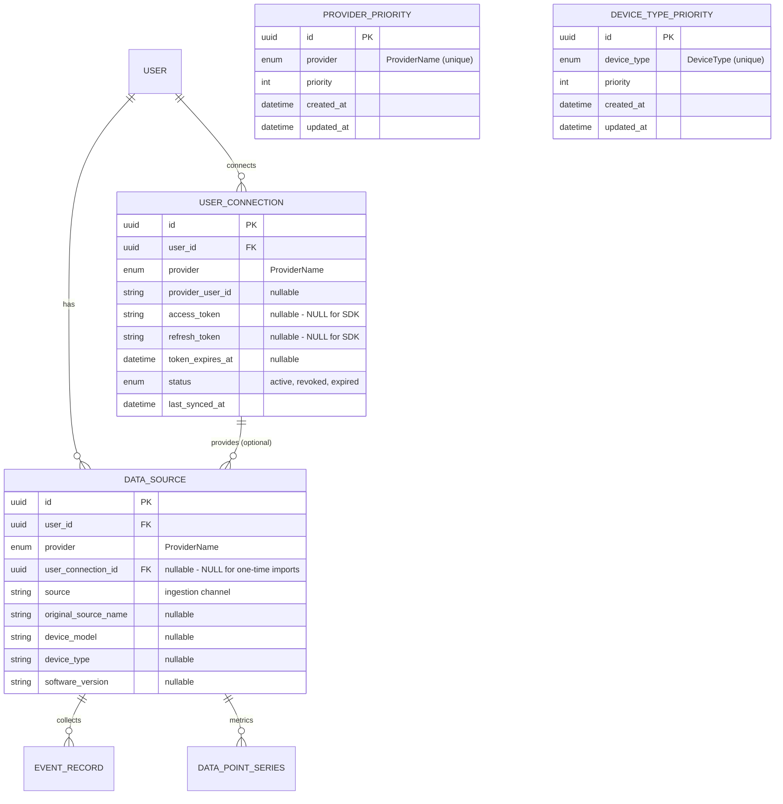

# Data Source & Priority Architecture

This document describes how Open Wearables handles data from multiple providers and devices, including prioritization logic for the `/summary` endpoints.

## Overview

The system needs to:
1. **Store all data** from all connected providers and devices
2. **Track original sources** when data comes through aggregators (e.g., Mi Body Composition Scale -> Zepp Life → Apple Health)
3. **Prioritize data** when returning summaries (provider priority + device type priority)
4. **Support fallback** when primary provider has no data

## Database Models

### 1. `USER_CONNECTION` (Active Connections Only)

Represents an **active, ongoing connection** to a data provider - both OAuth-based (Garmin, Suunto) and SDK-based (Apple Health SDK).

<Note>
**UserConnection is for active connections only.**

`UserConnection` represents a live, ongoing data sync relationship. It is **NOT** created for:
- One-time file imports (Apple Health XML export)

These one-time imports create `DataSource` records with `user_connection_id = NULL`.
</Note>

```python
class UserConnection(BaseDbModel):
    __tablename__ = "user_connection"
    __table_args__ = (
        UniqueConstraint("user_id", "provider", name="uq_user_provider"),
    )
    
    id: Mapped[PrimaryKey[UUID]]
    user_id: Mapped[FKUser]
    provider: Mapped[ProviderName]  # apple, garmin, suunto, polar, whoop, oura
    
    # Provider user data
    provider_user_id: Mapped[str | None]
    provider_username: Mapped[str | None]
    
    # OAuth tokens - NULL for SDK-based providers (Apple Health)
    access_token: Mapped[str | None]
    refresh_token: Mapped[str | None]
    token_expires_at: Mapped[datetime_tz | None]
    scope: Mapped[str | None]
    
    # Metadata - applies to ALL providers
    status: Mapped[ConnectionStatus]  # active, revoked, expired
    last_synced_at: Mapped[datetime_tz | None]
    created_at: Mapped[datetime_tz]
    updated_at: Mapped[datetime_tz]
```

**Why Apple Health SDK has a UserConnection record:**

1. **UI consistency**: The dashboard displays connected sources from `UserConnection`. Users see Apple Health as a connected source when actively syncing via SDK.

2. **Sync tracking**: `last_synced_at` shows when data was last received from the SDK.

3. **Status management**: Users can revoke Apple Health access in iOS Settings. Having a `status` field lets us track this (`active` → `revoked`).

4. **The only difference for Apple**: OAuth fields (`access_token`, `refresh_token`, `token_expires_at`) are `NULL`.

### 2. `DATA_SOURCE` (Extended)

Maps a user/provider/device combination into a reusable identifier.

```python
class DataSource(BaseDbModel):
    __tablename__ = "data_source"
    __table_args__ = (
        Index("idx_data_source_user_provider", "user_id", "provider"),
        Index(
            "uq_data_source_identity",
            "user_id",
            "provider",
            text("COALESCE(device_model, '')"),
            text("COALESCE(source, '')"),
            unique=True,
        ),
    )

    id: Mapped[PrimaryKey[UUID]]
    user_id: Mapped[FKUser]

    # Provider as enum - single source of truth
    provider: Mapped[ProviderName]

    # FK to UserConnection - NULL for one-time imports (XML, manual uploads)
    # Populated for active connections (SDK sync, OAuth API)
    user_connection_id: Mapped[FKUserConnection]

    # Technical ingestion channel.
    # Needed because a single provider can have multiple data channels:
    # - Apple: "apple_health_sdk", "apple_health_xml", "apple_health_auto_export"
    # - Garmin: "garmin_connect_api", potentially "garmin_webhook" or "BLE" for direct integration with watch's sensor
    source: Mapped[str_50 | None]

    # Original source name from aggregators (Zepp Life, AutoSleep)
    # NULL for direct provider APIs
    original_source_name: Mapped[str_100 | None]

    # Device info
    device_model: Mapped[str_100 | None]    # Watch7,2, iPhone14,5, Forerunner 265
    device_type: Mapped[str_32 | None]      # watch, phone, band, scale, ring
    software_version: Mapped[str_50 | None]
```

### 3. `PROVIDER_PRIORITY` (New)

System-wide priority configuration for data providers in `/summary` endpoints.

```python
class ProviderPriority(BaseDbModel):
    __tablename__ = "provider_priority"
    __table_args__ = (Index("idx_provider_priority_order", "priority"),)

    id: Mapped[PrimaryKey[UUID]]
    provider: Mapped[Unique[ProviderName]]
    priority: Mapped[int]  # 1 = highest
    created_at: Mapped[datetime_tz]
    updated_at: Mapped[datetime_tz]
```

### 4. `DEVICE_TYPE_PRIORITY` (New)

System-wide priority configuration for device types in `/summary` endpoints.

```python
class DeviceTypePriority(BaseDbModel):
    __tablename__ = "device_type_priority"
    __table_args__ = (Index("idx_device_type_priority_order", "priority"),)

    id: Mapped[PrimaryKey[UUID]]
    device_type: Mapped[Unique[DeviceType]]
    priority: Mapped[int]  # 1 = highest priority (watch), 99 = lowest (unknown)
    created_at: Mapped[datetime_tz]
    updated_at: Mapped[datetime_tz]
```

### 5. `DeviceType` (Enum + Default Priorities)

```python
class DeviceType(StrEnum):
    WATCH = "watch"
    BAND = "band"
    PHONE = "phone"
    SCALE = "scale"
    RING = "ring"
    OTHER = "other"
    UNKNOWN = "unknown"

# System-wide default device type priority (lower = higher priority)
# Used when database has no entries
DEFAULT_DEVICE_TYPE_PRIORITY: dict[DeviceType, int] = {
    DeviceType.WATCH: 1,
    DeviceType.BAND: 2,
    DeviceType.RING: 3,
    DeviceType.PHONE: 4,
    DeviceType.SCALE: 5,
    DeviceType.OTHER: 6,
    DeviceType.UNKNOWN: 99,
}
```

## ERD Diagram



## Connection Types

| Type | Has UserConnection? | user_connection_id | Example |
|------|--------------------|--------------------|---------|
| **Active SDK sync** | ✅ Yes | Populated | Apple Health SDK continuously syncing |
| **OAuth API** | ✅ Yes | Populated | Garmin, Suunto, Polar, Whoop, Oura |
| **Auto Export app** | ✅ Yes | Populated | 3rd party app regularly pushing data |
| **One-time XML import** | ❌ No | `NULL` | User uploads Apple Health XML export file |

**Key distinction**: 
- **Active connection** = ongoing sync relationship (SDK, OAuth API, Auto Export) → creates `UserConnection`
- **One-time import** = single file upload, no ongoing sync → only `DataSource` with `NULL` connection

## UserConnection Examples

Only active connections have `UserConnection` records:

| provider | access_token | refresh_token | token_expires_at | status | last_synced_at |
|----------|--------------|---------------|------------------|--------|----------------|
| `apple` | `NULL` | `NULL` | `NULL` | `active` | `2026-01-28 10:00` |
| `garmin` | `"abc123..."` | `"xyz789..."` | `2026-02-01` | `active` | `2026-01-28 09:30` |
| `suunto` | `"def456..."` | `"uvw012..."` | `2026-01-30` | `active` | `2026-01-27 15:00` |
| `oura` | `"ghi789..."` | `"rst345..."` | `2026-02-15` | `active` | `2026-01-28 08:00` |

**Note**: Apple's row has `NULL` OAuth fields but still tracks `status` and `last_synced_at` because it's an active SDK sync.

## Data Source Examples

### All Scenarios

| Scenario | provider | user_connection_id | source | original_source_name | device_model | device_type |
|----------|----------|-------------------|--------|---------------------|--------------|-------------|
| **Apple Watch via SDK** | `apple` | `conn-apple` | `apple_health_sdk` | `Apple Watch (Jan)` | `Watch7,2` | `watch` |
| **iPhone via SDK** | `apple` | `conn-apple` | `apple_health_sdk` | `iPhone` | `iPhone14,5` | `phone` |
| **Zepp Life → Apple Health SDK** | `apple` | `conn-apple` | `apple_health_sdk` | `Zepp Life` | `NULL` | `unknown` |
| **AutoSleep → Apple Health SDK** | `apple` | `conn-apple` | `apple_health_sdk` | `AutoSleep` | `NULL` | `unknown` |
| **Manual entry via SDK** | `apple` | `conn-apple` | `apple_health_sdk` | `Health` | `NULL` | `unknown` |
| **Auto Export app** | `apple` | `conn-apple-ae` | `apple_health_auto_export` | `NULL` | `NULL` | `unknown` |
| **Apple Health XML import** | `apple` | `NULL` | `apple_health_xml` | `Apple Watch (Jan)` | `Watch3,3` | `watch` |
| **XML import: Zepp Life data** | `apple` | `NULL` | `apple_health_xml` | `Zepp Life` | `NULL` | `unknown` |
| **Garmin Forerunner** | `garmin` | `conn-garmin` | `garmin_connect_api` | `NULL` | `Forerunner 265` | `watch` |
| **Garmin Venu** | `garmin` | `conn-garmin` | `garmin_connect_api` | `NULL` | `Venu 3` | `watch` |
| **Garmin Index Scale** | `garmin` | `conn-garmin` | `garmin_connect_api` | `NULL` | `Index S2` | `scale` |
| **Garmin Vivosmart** | `garmin` | `conn-garmin` | `garmin_connect_api` | `NULL` | `Vivosmart 5` | `band` |
| **Suunto Vertical** | `suunto` | `conn-suunto` | `suunto_api` | `NULL` | `Suunto Vertical` | `watch` |
| **Polar Vantage** | `polar` | `conn-polar` | `polar_api` | `NULL` | `Vantage V3` | `watch` |
| **Whoop 4.0** | `whoop` | `conn-whoop` | `whoop_api` | `NULL` | `WHOOP 4.0` | `band` |
| **Oura Ring Gen3** | `oura` | `conn-oura` | `oura_api` | `NULL` | `Oura Ring Gen3` | `ring` |

### Key Observations

- **`user_connection_id = NULL`** for one-time imports (XML file upload). These are single file uploads without an ongoing sync relationship.
- **`user_connection_id` populated** for active connections (SDK sync, OAuth API, Auto Export app). These have an ongoing sync relationship.
- **Apple Health as aggregator**: When data comes through Apple Health from 3rd party apps (Zepp Life, AutoSleep), we lose device information. The `original_source_name` preserves the app name.
- **Multiple DataSources per connection**: One `UserConnection` (e.g., `conn-garmin`) can have multiple `DataSource` records (Forerunner, Venu, Index Scale) - one per device.

## Apple Health Connection Lifecycle

Since Apple Health SDK is an active connection (not OAuth), the `UserConnection` record is created on first SDK sync:

### Creation

```python
# Called on first data sync from Apple Health SDK
def ensure_apple_connection(db: DbSession, user_id: UUID) -> UserConnection:
    """Create Apple Health connection if not exists."""
    existing = connection_repo.get_by_user_and_provider(db, user_id, ProviderName.APPLE)
    if existing:
        existing.last_synced_at = datetime.now(UTC)
        existing.status = ConnectionStatus.ACTIVE
        return existing
    
    return connection_repo.create(db, UserConnectionCreate(
        user_id=user_id,
        provider=ProviderName.APPLE,
        status=ConnectionStatus.ACTIVE,
        last_synced_at=datetime.now(UTC),
        # OAuth fields are NULL for SDK providers
        access_token=None,
        refresh_token=None,
        token_expires_at=None,
    ))
```

### Status Changes

| Event | Action |
|-------|--------|
| First sync from SDK | Create `UserConnection` with `status=active` |
| Subsequent syncs | Update `last_synced_at` |
| User revokes in iOS Settings | Set `status=revoked` (detected via SDK error) |
| User re-enables access | Set `status=active` |

### XML Import (No Connection)

```python
# XML import does NOT create UserConnection - it's a one-time action
def import_xml_data(db: DbSession, user_id: UUID, xml_file: bytes) -> None:
    """Import Apple Health XML export. No UserConnection created."""
    
    for record in parse_xml(xml_file):
        # DataSource with user_connection_id = NULL
        data_source = ensure_data_source(
            db,
            user_id=user_id,
            provider=ProviderName.APPLE,
            user_connection_id=None,  # No active connection
            source="apple_health_xml",
            device_model=record.device_model,
            original_source_name=record.source_name,
        )
        # ... save data points
```

## Provider Priority Configuration

System-wide provider priority configuration stored in the `provider_priority` table. Default values:

| provider | priority | Description |
|----------|----------|-------------|
| `apple` | 1 | Apple has highest priority |
| `garmin` | 2 | Garmin as fallback |
| `polar` | 3 | Polar third |
| `suunto` | 4 | Suunto fourth |
| `whoop` | 5 | Whoop fifth |

<Note>
**Oura not in default priorities.**

The `oura` provider exists in the `ProviderName` enum but is not included in the default priority configuration. It will be assigned priority 99 (lowest) until explicitly configured.
</Note>

## Prioritization Logic

### `/summary` Endpoint Flow

```
┌─────────────────────────────────────────────────────────────────┐
│                    GET /v1/users/{id}/summary                   │
├─────────────────────────────────────────────────────────────────┤
│  1. Get PROVIDER_PRIORITY (system-wide config)                  │
│     → [apple:1, garmin:2, polar:3, suunto:4, whoop:5]           │
│                                                                 │
│  2. For each provider (by priority):                            │
│     → Check if user has data from this provider                 │
│     → If yes → select this provider                             │
│     → If no → fallback to next                                  │
│                                                                 │
│  3. Within selected provider:                                   │
│     → Group data by device_type                                 │
│     → Select device_type by DEVICE_TYPE_PRIORITY                │
│       (watch > band > ring > phone)                             │
│                                                                 │
│  4. Aggregate and return data                                   │
└─────────────────────────────────────────────────────────────────┘
```

### Example: User with Multiple Sources

**User Jan has:**
- Apple Watch (via Apple Health SDK) - active connection
- iPhone (via Apple Health SDK) - active connection
- Zepp Life / Mi Band (via Apple Health SDK) - active connection
- Garmin Forerunner (via Garmin API) - active connection
- Old data from XML import - no connection

**USER_CONNECTION records for Jan:**

| id | provider | access_token | status | last_synced_at |
|----|----------|--------------|--------|----------------|
| conn-apple | apple | `NULL` | active | 2026-01-28 10:00 |
| conn-garmin | garmin | `"abc..."` | active | 2026-01-28 09:30 |

**DATA_SOURCE records for Jan:**

| id | provider | user_connection_id | source | original_source_name | device_model | device_type |
|----|----------|-------------------|--------|---------------------|--------------|-------------|
| ds-1 | apple | conn-apple | apple_health_sdk | Apple Watch (Jan) | Watch7,2 | watch |
| ds-2 | apple | conn-apple | apple_health_sdk | iPhone | iPhone14,5 | phone |
| ds-3 | apple | conn-apple | apple_health_sdk | Zepp Life | NULL | unknown |
| ds-4 | garmin | conn-garmin | garmin_connect_api | NULL | Forerunner 265 | watch |
| ds-5 | apple | `NULL` | apple_health_xml | Apple Watch (Jan) | Watch3,3 | watch |

**Request for steps on 2026-01-28:**

1. **Provider priority** (system config): apple=1, garmin=2
2. **Select Apple** (has data, priority 1)
3. **Device type priority**: watch > band > ring > phone > unknown
4. **Return steps from ds-1** (Apple Watch via SDK)

**Fallback scenario:**
- If Apple Watch has no data → use iPhone (ds-2)
- If iPhone has no data → use Zepp Life (ds-3)
- If Apple has no data at all → use Garmin (ds-4)

**Note**: ds-5 (XML import) is still included in queries - it's valid data, just without an active connection.

## Implementation Notes

### Device Type Detection

Device type is derived using two functions:

1. **`infer_device_type_from_model()`** - Primary method using device model string:
   - **Apple**: Parse `product_type` (e.g., `Watch7,2` → `watch`, `iPhone14,5` → `phone`)
   - **Garmin**: Match device model keywords (`Forerunner` → `watch`, `Vivosmart` → `band`, `Index` → `scale`)
   - **Polar**: Match patterns (`Vantage`, `Pacer` → `watch`)
   - **Suunto**: Match patterns (`Vertical`, `Race` → `watch`)
   - **Whoop**: All devices → `band`
   - **Oura**: Pattern `oura` or `ring` → `ring`

2. **`infer_device_type_from_source_name()`** - Fallback for aggregated data:
   - Use heuristics from `original_source_name` (e.g., "Mi Band" → `band`, "AutoSleep" → `watch`)

### Data Storage vs. Data Retrieval

- **Storage**: All data from all providers/devices is stored (no filtering)
- **Retrieval**: Priority logic applies only to `/summary` endpoints
- **Raw endpoints**: Return all data without prioritization (for debugging/analysis)

## Design Decisions

The following architectural decisions have been made:

| Decision | Choice | Rationale |
|----------|--------|-----------|
| **Priority scope** | Per-provider (not per-metric) | Simplifies configuration; one priority ranking for all metrics |
| **Revoked connection data** | Keep and use in /summary | Historical data remains valuable even after disconnect |
| **Multiple accounts per provider** | Not allowed | Constraint `(user_id, provider)` - simplifies model and UI |
| **Partial data** | Use priority provider regardless of coverage | First iteration always uses highest-priority provider with any data; coverage-based fallback planned for future |

## Cross-Source Deduplication

### Problem

A user may have multiple data channels from the same provider:
- Apple Health SDK (real-time sync)
- Apple Health Auto Export (batch export app through 3rd party app)
- Apple Health XML (one-time import)

This can result in duplicate data for the same events/metrics.

### Solution

Deduplication happens at the **data persistence layer**, not at the DataSource level:

```python
# EventRecord deduplication
# Constraint: (user_id, start_datetime, end_datetime, event_type)
# Ignores: data_source_id, source channel

# DataPointSeries deduplication
# Constraint: (user_id, series_type_definition_id, recorded_at)
# Ignores: data_source_id, source channel
```

<Note>
**Cross-source deduplication is user-scoped.**

When inserting data, we check for existing records matching the user + timestamp + metric type, regardless of which `source` channel delivered it. This means:
- SDK data won't duplicate Auto Export data
- XML import won't duplicate SDK data
- The first source to deliver data "wins"
</Note>

### Implementation

```python
def bulk_create_event_records(records: list[EventRecordCreate]) -> list[EventRecord]:
    """Insert records with cross-source deduplication."""
    stmt = insert(EventRecord).values([...])
    stmt = stmt.on_conflict_do_nothing(
        index_elements=["user_id", "start_datetime", "end_datetime", "event_type"]
    )
    return db.execute(stmt)
```

## Partial Data Fallback (Future)

<Note>
**Not implemented in first iteration.**

The current implementation always uses the highest-priority provider that has any data for the requested period. Coverage-based fallback strategies will be added in a future release.
</Note>

### Problem

The priority provider may have incomplete data for a given day:
- Apple Watch battery died at 14:00
- Garmin has full 24-hour data
- Which source should `/summary` use?

### Current Behavior

The system uses the **highest-priority provider with any data**, regardless of coverage:

```
User Jan on 2026-01-28:
- Apple (priority 1): 14 hours of data = 58% coverage
- Garmin (priority 2): 24 hours of data = 100% coverage

Result: Use Apple data (highest priority with data)
```

### Future Enhancement: Coverage-Based Fallback

A future release may implement **coverage-based fallback** with a configurable threshold:

```
┌─────────────────────────────────────────────────────────────────┐
│              Partial Data Fallback Algorithm (PLANNED)           │
├─────────────────────────────────────────────────────────────────┤
│  1. For each provider (by priority order):                       │
│     a. Query data for the requested date                         │
│     b. Calculate coverage percentage                             │
│     c. If coverage >= threshold (80%) → use this provider        │
│     d. If coverage < threshold → try next provider               │
│                                                                  │
│  2. If no provider meets threshold:                              │
│     → Use provider with highest coverage (regardless of value)   │
└─────────────────────────────────────────────────────────────────┘
```

## NULL Device Model Handling

### Problem

Data from aggregators (Zepp Life, AutoSleep) often lacks device information:
- `device_model = NULL`
- `device_type = unknown`

The unique constraint `(user_id, provider, device_model, source)` needs special handling for NULLs.

### PostgreSQL NULL Behavior

```sql
-- PostgreSQL: NULL != NULL in unique constraints
-- These would BOTH succeed (creating duplicates):
INSERT INTO data_source (user_id, provider, device_model, source)
VALUES ('user-1', 'apple', NULL, 'apple_health_sdk');

INSERT INTO data_source (user_id, provider, device_model, source)
VALUES ('user-1', 'apple', NULL, 'apple_health_sdk');
```

### Solution

Functional unique index with `COALESCE` for both nullable columns:

```sql
CREATE UNIQUE INDEX uq_data_source_identity
ON data_source (user_id, provider, COALESCE(device_model, ''), COALESCE(source, ''));
```

This ensures that `(user-1, apple, NULL, apple_health_sdk)` is treated as `(user-1, apple, '', 'apple_health_sdk')` for uniqueness purposes.

### Device Type Inference

Two functions handle device type inference:

**1. From device model string:**

```python
def infer_device_type_from_model(device_model: str | None) -> DeviceType:
    """Infer device type from device model string.

    Handles Apple productType codes and common device model patterns.
    """
    if not device_model:
        return DeviceType.UNKNOWN

    # Apple productType codes
    if device_model.startswith("Watch"):
        return DeviceType.WATCH
    if device_model.startswith("iPhone"):
        return DeviceType.PHONE
    if device_model.startswith("iPad"):
        return DeviceType.PHONE  # Treat iPad as phone for priority purposes

    # Common keywords (watch, band, ring, phone, scale)
    # Garmin patterns (forerunner, fenix, venu, vivosmart, index)
    # Polar patterns (vantage, grit x, pacer)
    # Suunto patterns (suunto, vertical, race)
    # Whoop patterns (whoop -> band)
    # ...
    return DeviceType.OTHER
```

**2. From original source name (for aggregated data):**

```python
def infer_device_type_from_source_name(source_name: str | None) -> DeviceType:
    """Infer device type from original source name.

    Used when device_model is not available (e.g., data from Zepp Life via Apple Health).
    """
    if not source_name:
        return DeviceType.UNKNOWN

    name_lower = source_name.lower()

    if "autosleep" in name_lower:
        return DeviceType.WATCH  # AutoSleep requires Apple Watch
    if "mi band" in name_lower or "xiaomi" in name_lower:
        return DeviceType.BAND
    if "amazfit band" in name_lower:
        return DeviceType.BAND
    if "oura" in name_lower:
        return DeviceType.RING
    if "zepp life" in name_lower:
        return DeviceType.UNKNOWN  # Could be watch or band

    return DeviceType.UNKNOWN
```

## Revoked Connection Data

### Behavior

When a user revokes access to a provider (status changes to `revoked`):

1. **Data is preserved** - Historical data remains in the database
2. **Data is usable** - `/summary` endpoints can still return this data
3. **Priority unchanged** - Revoked providers keep their priority position
4. **Preference for active** - When two providers have same priority, prefer `active` over `revoked`

### Example

```
User disconnects Garmin on July 1st:
- UserConnection: status = revoked
- DataSource records: unchanged
- Historical data (Jan-Jun): still available in /summary
- New data (Jul+): not synced (no active connection)
```

### UI Implications

The dashboard should:
- Show revoked connections with clear visual distinction
- Allow users to re-enable (which sets status back to `active`)
- Provide option to delete all data from a provider (GDPR compliance)

## Edge Cases

### 1. Same Workout from Multiple Devices

**Scenario**: User runs with Apple Watch AND Garmin watch simultaneously.

**Behavior**: Both workouts are stored (different DataSources). Priority logic selects one for `/summary`.

**Future enhancement**: Detect overlapping workouts by time range and mark as potential duplicates.

### 2. Device Migration

**Scenario**: User upgrades from Apple Watch Series 7 to Series 9.

**Behavior**:
- New DataSource created for Series 9
- Historical data from Series 7 preserved
- Both contribute to `/summary` (same provider, same device_type)

### 3. Timezone Changes

**Scenario**: User travels from Warsaw (UTC+1) to New York (UTC-5).

**Behavior**:
- All timestamps stored in UTC
- Daily summaries calculated based on user's configured timezone (stored in user profile)
- Date boundaries shift with timezone

<Warning>
**Timezone handling is currently basic.**

The system stores all data in UTC. Daily aggregations use the timezone from `user.timezone` preference. Complex scenarios (mid-day timezone changes, DST transitions) may show unexpected behavior in edge cases.
</Warning>

### 4. Provider Sends Updated Data

**Scenario**: User edits workout distance in Garmin Connect after initial sync.

**Current behavior**: Updated data may create new records (different external_id or timestamp).

**Future enhancement**: Use `external_id` to detect and update existing records.

### 5. Multiple Readings at Same Timestamp

**Scenario**: Apple Watch and Oura Ring both record HR at exactly 10:00:00.

**Behavior**: Both stored (different DataSources). Summary uses priority logic to select one.

---

## Future Considerations

The following are **not currently implemented** but may be added:

1. **Coverage-based fallback** - Fall back to secondary provider when primary has incomplete data (e.g., <80% coverage)
2. **Per-metric priority** - Different provider rankings for sleep vs. activity vs. body metrics
3. **Data quality scoring** - Weight measurements from scale > manual entry
4. **Aggregator chain tracking** - Track full path: Device → App → Apple Health → Our system
5. **Automatic duplicate detection** - Flag overlapping workouts for user review
