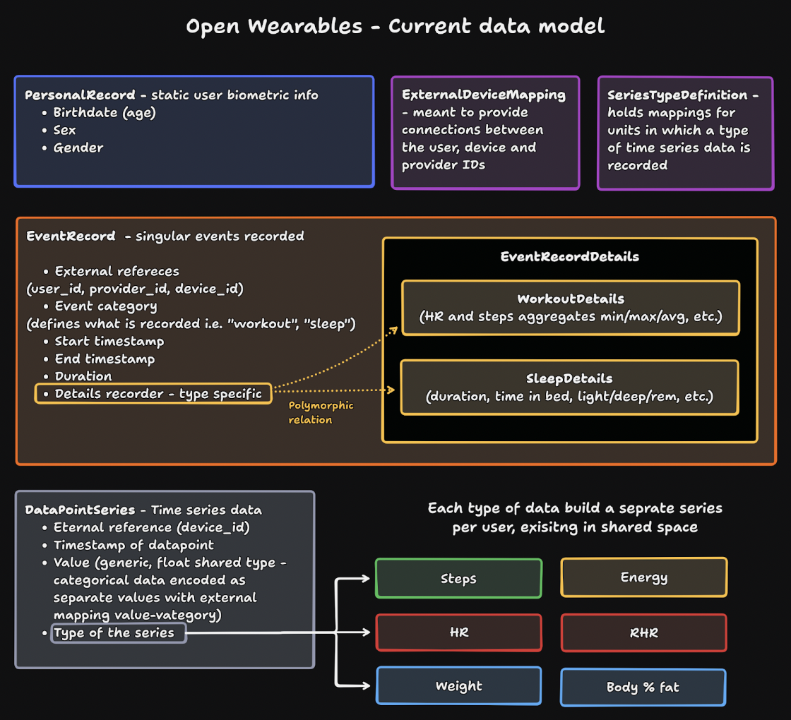
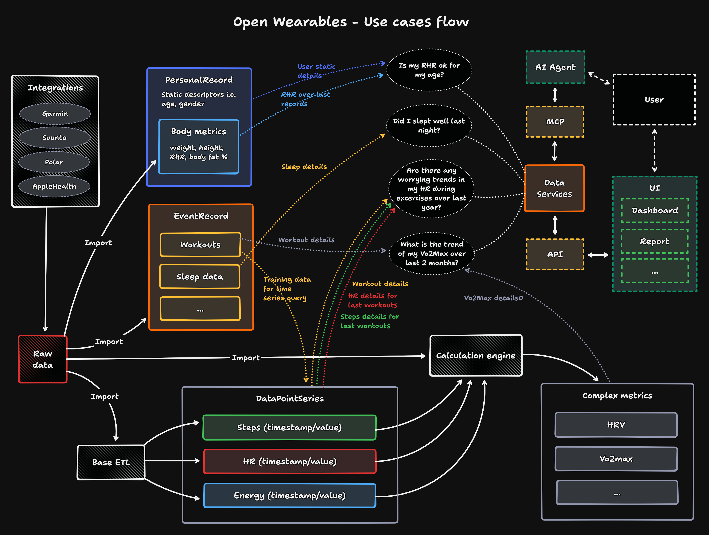
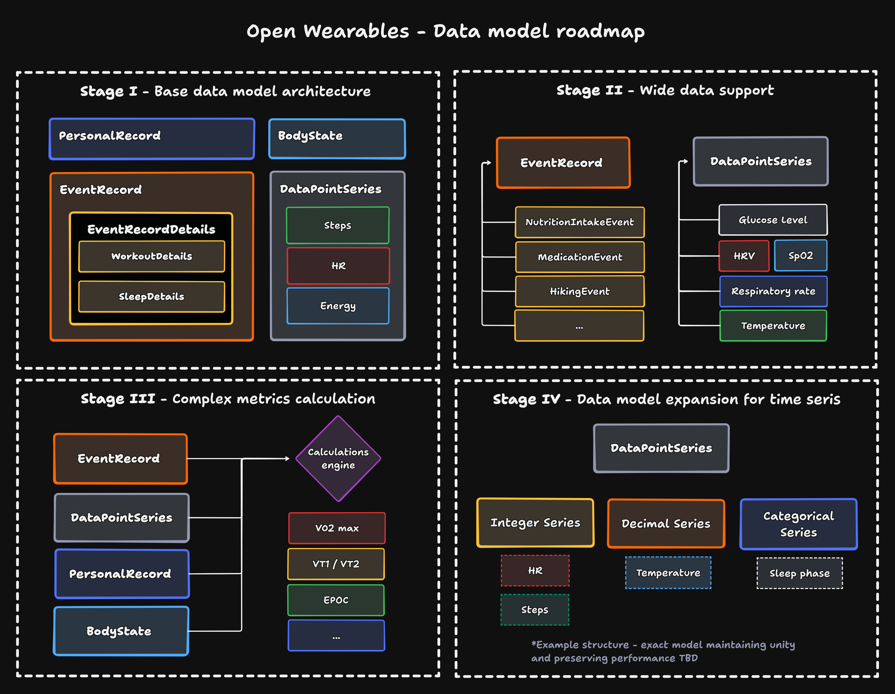

The Open Wereables project aims to unifies health monitoring data - to do that, a stable, optimised data architecture is paramount. This problem is not trivial, as we face raw data served in heterogeneous formats, with potential erroneous observations, noise interfering with the recorded values and other such issues. On top of that, the potential volume of data is a problem on its own, and without proper structure optimization will be unacceptably memory taxing, calculation intensive, if not both.

## Technical overview

To answer this issue we propose a unified data model - designed for wearable data storage.

## Design goals

The design goals behind outlined structure were as follow:
- **Uniformity** - the structures must be as consistent as possible, handling similar datatypes in similar ways. This serves two purposes
- **Ease of work** - Any developer interacting with the data needs to see a clear structure, that can be modified without excessive documentation hunting
- **Straightforward analytics** - Any service - be it internal, or working as a datasink, needs to interact with consistent data structures, that can be easily connected, offering the freedom of a full multivariate data model
- **Modularity** - The structure must be easily extendible, allowing for additional subtypes, coming from multiple providers. This is dictated by both the fast pace of the wearables market, as well as the multiple use cases for wearable data - we cannot lock ourselves into few predefined datatypes
- **Compressibility** - As the data stored will amount to fast growing, vast volumes of observations, we must optimize for storage efficiency. Time series data is notoriously storage intensive and needs to be accounted for.
- **Efficiency** - The data is to be used, not simply stored - we aim to provide a strong and efficient backbone for analytics and computation, and while memory optimisation is the primary concern, efficiency of handling is a close second.

## Data Structure

Those goals led us to employ a structure, consisting of three core components:
- **Events** (*EventRecord + EventRecordDetails*) - is meant to store singular records or events, with multiple descriptors and aggregate values that can be defined for the whole period of the event. Those are defined by a prolonged in time structure (meaning start/stop timestamps and duration).
  - Each event is assigned a type, supporting one of the activities existing in the system (i.e. workout)
  - Supporting the core EventRecord structure is an EventRecordDetails tied to it - this record is dictated by the type of the event, and holds the type specific aggregates and values
- **Series** (*DataPointSeries*) - is meant to store all the medium to high frequency time series in a shared space, demarcated by type and source device id assigned to each data point
  - The observation values are stored as float values, offering no data loss between integer and float values possible for different observation types, as well as handling categorical data as numerical encoding
  - **Note: this is a current concession as we are fully aware of the adverse effect this has on storage space optimisation - this stopgap is planned to be easily migrated as described in the roadmap section**
- **Descriptors** (*PersonalRecord*) - stores static user biometric information that changes slowly, if ever. Currently includes birth date (used for age calculation), sex, and gender. This structure is designed to be extended with additional static or slow-changing user attributes as needed.
  - The time series data will be stored in the initial release along other series - eventually, BodyState table that backreferences a user that it is tied to, and holds all the supported and potentially possible descriptors will be introduced - here null values and redundant fields are a lesser evil, as the records will be sparse, and avoiding structure bloat is a bigger gain
- **ID mapping** (*ExternalDeviceMapping*) - mapping internal reference id to a combination of user/device/provider, ensuring clear identification of the source, while preventing structure clutter with excessive IDs in other tables and reducing datapoint width, especially important for time series data
**Series descriptors** (*SeriesTypeDefinition*)  - meant to store series related details, applicable for the entire series type (i.e. unit type in which values are stored). This way we avoid redundant fields in the time series table, eventually ending up with minimal implementation of the datapoints.

## Technical backbone

The current iteration is fully built using python native methods - utilising SQLalchemy for model declaration, pydantic for data validation and passing within the service. This layer of abstraction offers modularity and extensibility (via Alembic) in line with our stated goals.

The proposed model fits with the wider open wearables environment and use cases - it serves as a strong foundation layer for future data processing, computation of complex metrics, and what is at heart of the project - ease of access to the insights and patterns within the stored data. 
This data is designed to be served via multiple channels, accessible through dedicated services serving this data as either classical API endpoints, or new access methods such as MCP servers and AI agents. 

## Roadmap

The presented unified data model is a first iteration of the underlying Open Wearables data structure - we fully intend to expand upon it, and introduce new features. Some of the planned stages of development are as follows:
1. **Base model architecture (starting point)** - The base data model discussed above, provided with the first release of the Open Wearables platform’
2. **Wide data support** - consists of extending the existing data structures with wide support for both events and series existing in the wider wearables ecosystem
3. **Complex metrics calculation** - assumes extension of the currently existing base types of time series with complex metrics, covering both multivariate datapoints and derivative values, calculated from other datapoints. Here, reaching a compromise between incoming, registered data (come of the complex types are widely supported and will be received as raw data), and our internal calculation - the goal will be to validate and use the most trusted ones, according to either user defined priority configuration, or calculated trust scores.
4. **Data model expansion for time series** - at this stage, we assume that the time series shared model will need to be revisited. As stated in the initial description, the current approach is a stopgap, potentially sacrificing the storage optimisation - as our stated goal is to avoid unnecessary memory bloat, this will need to be resolved, using insight from the earlier stages and potential feedback. The presented structure is one of the possibilities, splitting the series according to data types, representing a compromise between classic data warehousing and relational databases. Here we can also think about separating the time series data describing the user body states into separate, snapshot-like records.
