## Architecture Overview


Garmin data arrives exclusively via webhooks. There are no REST pull endpoints (forbidden by Garmin's API terms). The system requests historical data via backfill endpoints, then Garmin delivers the data asynchronously through webhook callbacks.

## Data Flow

### Real-time (ongoing after connection)


### Historical backfill (on first connection)

```mermaid
graph TD
    A["OAuth callback"] --> B["start_full_backfill"]
    B --> C{"Single 30-day window"}
    C --> D{"For each of 5 data types<br/>(sequential)"}
    D --> E["POST backfill request<br/>to Garmin"]
    E --> F{"Webhook arrives<br/>within 5 min?"}
    F -->|"Yes"| G["mark_type_success"]
    F -->|"No"| H["Timeout → skip"]
    G --> D
    H --> D
    D -->|"All types done"| I["Advance to<br/>next window"]
    I --> C
    C -->|"All windows done"| J["Retry timed-out types"]
    J --> K["Release lock,<br/>mark complete"]
```



## OAuth Connection

<Info>
**File:** `backend/app/api/routes/v1/oauth.py`
</Info>

Garmin uses OAuth 2.0 with PKCE. The flow:

1. Frontend redirects user to `GET /api/v1/oauth/{provider}/authorize`
2. User grants permissions on Garmin's site
3. Garmin redirects back to `GET /api/v1/oauth/{provider}/callback`
4. Callback handler:
   - Creates/updates `UserConnection` in the database
   - Dispatches `sync_vendor_data.delay()` for initial sync
   - For Garmin specifically: dispatches `start_garmin_full_backfill.delay(user_id)`

The backfill starts automatically on connection. There is no manual "Sync Now" button for Garmin in the frontend.

<Warning>
If the user didn't grant the `HISTORICAL_DATA_EXPORT` permission, all backfill requests will return 403. All 5 types fail together in this case.
</Warning>

## Webhook Handlers (PING/PUSH)

<Info>
**File:** `backend/app/api/routes/v1/garmin_webhooks.py`
</Info>

Garmin sends two types of webhooks:

### PING (callback-based)

`POST /api/v1/garmin_webhooks/ping`

Garmin sends a notification with callback URLs. The handler fetches the actual data from those URLs.

```json
{
  "sleeps": [{"userId": "garmin-uid", "callbackURL": "https://..."}],
  "dailies": ["..."],
  "activities": ["..."]
}
```

**Processing flow per notification:**

1. Extract callback URL from notification
2. Fetch data via `httpx.get(callback_url)` with OAuth token
3. Find internal user via Garmin user ID mapping
4. Batch-process via `Garmin247Data.process_items_batch()`
5. Commit to PostgreSQL
6. If a backfill is active: call `mark_type_success(user_id, data_type)`
7. On new success transition: call `trigger_next_pending_type.delay()`

### PUSH (direct payload)

For data types where Garmin sends the payload directly in the webhook body rather than a callback URL.

### Backfill chain integration

The webhook handlers are the bridge between Garmin's async data delivery and the backfill state machine. When a webhook arrives for a type that was requested via backfill:

- `mark_type_success()` transitions the type from `triggered` to `success`
- Only on a new transition (returns `True`), `trigger_next_pending_type` is enqueued
- This chains the sequential processing: request type -> await webhook -> next type

All 16 data types are handled by the webhook regardless of whether they're included in backfill orchestration. The 5-type restriction only applies to which types are actively requested during backfill.

## Backfill Orchestration

### Configuration

<Info>
**File:** `backend/app/services/providers/garmin/backfill_config.py`
</Info>

| Constant | Value | Purpose |
|----------|-------|---------|
| `BACKFILL_DATA_TYPES` | 5 types | Types included in backfill (sleeps, dailies, activities, activityDetails, hrv) |
| `ALL_DATA_TYPES` | 16 types | All types handled by webhooks |
| `BACKFILL_WINDOW_COUNT` | 1 | Single 30-day window (Garmin's max allowed range) |
| `BACKFILL_CHUNK_DAYS` | 30 | Days per window (Garmin API limit) |
| `MAX_BACKFILL_DAYS` | 30 | Total lookback (Garmin only allows 30 days before user registration) |
| `TRIGGERED_TIMEOUT_SECONDS` | 300 | 5-min timeout per type before skipping |
| `DELAY_BETWEEN_TYPES` | 2 | Seconds between type requests (rate limit budget) |
| `BACKFILL_LOCK_TTL` | 5100 | ~1.4-hour lock TTL (safety net) |
| `REDIS_TTL` | 604800 | 7-day TTL for all tracking keys |
| `GC_STUCK_THRESHOLD_SECONDS` | 600 | 10 minutes of no activity = stuck |
| `GC_SCAN_INTERVAL_SECONDS` | 180 | GC runs every 3 minutes |
| `GC_MAX_ATTEMPTS` | 3 | Max GC cycles before permanently failed |

<Note>
**Rate limiting:** Garmin allows 100 requests/minute. Backfill reserves 30% of the budget (30 req/min), resulting in a 2-second delay between type requests.
</Note>

### State Machine

<Info>
**File:** `backend/app/integrations/celery/tasks/garmin_backfill_task.py`
</Info>

The backfill operates as a Celery task chain with three phases:

#### Phase 1: Sequential window processing


#### Phase 2: Retry (after window completes)

When all windows are exhausted, timed-out types get one retry:


<Note>
A second timeout during retry escalates the type from `timed_out` to `failed` (permanent). This is distinct from `timed_out` which indicates the type may succeed if retried.
</Note>

#### Phase 3: Garbage collection (background)

See [Garbage Collection](#garbage-collection) below.

### Window Progression

The backfill processes a single 30-day window, covering the maximum range allowed by Garmin (data from the last 30 days before user registration):

```
Window 0:  [now - 30d,  now]
```

The anchor timestamp is fixed at backfill start so all date boundaries are consistent.

**Per-window flow:**

1. For each of the 5 types: trigger -> await webhook or timeout -> next type
2. `persist_window_results()` copies flat type status keys to per-window matrix keys
3. `advance_window()` increments the window counter and resets flat keys to "pending"
4. If more windows remain, trigger the first type for the new window

**Cancel support:** The cancel flag is checked between types and between windows. When cancelled, the current window's results are persisted and the backfill stops gracefully.

### Retry Phase

After the window completes, the system checks for timed-out entries:

- `get_retry_targets()` reads the `timed_out_types` JSON list from Redis
- Deduplicates by keeping only the latest (highest) window per type
- Each target is retried once using the same `trigger_backfill_for_type` infrastructure
- The retry uses the original window's date range (not the current sequential window)
- The main window counter is not modified during retry

**Escalation rules:**

- Webhook arrives during retry: type marked `done` in matrix
- Timeout during retry: type escalated to `failed` (not `timed_out`)
- `failed` is a terminal state with no further retries

### Garbage Collection

<Info>
**File:** `backend/app/integrations/celery/tasks/garmin_gc_task.py`
</Info>

A Celery beat task runs every 3 minutes to detect and clear stuck backfills:


**Design choices:**

- GC preserves completed window data -- only the lock is cleared
- The currently-triggered type is recorded for retry via `record_timed_out_entry()`
- After lock release, the user can re-trigger backfill (via disconnect/reconnect)
- After 3 GC cycles (`GC_MAX_ATTEMPTS`), the backfill is marked permanently failed
- GC skips users in an active retry phase to avoid interference
- When no backfills are active, the task is essentially a no-op (one empty SCAN)

**Detection timeline:** A stuck backfill is detected within ~13 minutes (10-min threshold + up to 3-min scan interval).

### Redis Key Schema

All keys use the prefix `garmin:backfill:{user_id}:` and have a 7-day TTL.

#### Lock and control

| Key | Type | Purpose |
|-----|------|---------|
| `:lock` | string | Exclusive backfill lock (SETNX, 6h TTL) |
| `:trace_id` | string | Session-level trace ID for log correlation |
| `:cancel_flag` | string | Set to "1" to request graceful cancellation |
| `:permanently_failed` | string | Set to "1" after 3 GC cycles |
| `:attempt_count` | integer | GC attempt counter (INCR) |

#### Window tracking

| Key | Type | Purpose |
|-----|------|---------|
| `:window:current` | integer | Current window index (0-based) |
| `:window:total` | integer | Total windows (12) |
| `:window:anchor_ts` | ISO timestamp | Fixed reference for date range calculations |
| `:window:completed_count` | integer | Number of completed windows |

#### Per-type flat keys (current window)

| Key | Type | Values |
|-----|------|--------|
| `:types:{type}:status` | string | `pending`, `triggered`, `success`, `timed_out`, `failed` |
| `:types:{type}:triggered_at` | ISO timestamp | When the backfill request was sent |
| `:types:{type}:completed_at` | ISO timestamp | When webhook data arrived |
| `:types:{type}:error` | string | Error message if failed |
| `:types:{type}:trace_id` | string | Per-type trace ID |
| `:types:{type}:skip_count` | integer | Number of timeouts for this type |

#### Per-window matrix keys (persisted history)

| Key | Type | Values |
|-----|------|--------|
| `:w:{window}:{type}:status` | string | `done`, `pending`, `timed_out`, `failed` |

These are written by `persist_window_results()` when advancing to the next window, and by `update_window_cell()` during retry.

#### Retry phase keys

| Key | Type | Purpose |
|-----|------|---------|
| `:retry_phase` | string | "1" when retry phase is active |
| `:retry_targets` | JSON list | Remaining `[{type, window}]` entries to retry |
| `:retry_current_window` | integer | Window index of the current retry target |
| `:retry_current_type` | string | Data type being retried |

#### Timeout tracking

| Key | Type | Purpose |
|-----|------|---------|
| `:timed_out_types` | JSON list | All timed-out entries `[{type, window}]` for retry |

## API Endpoints

<Info>
**File:** `backend/app/api/routes/v1/sync_data.py`

All endpoints require API key authentication (`ApiKeyDep`).
</Info>

### GET /api/v1/providers/garmin/users/\{user_id\}/backfill/status

Returns the full backfill status matrix.

**Response:**

```json
{
  "overall_status": "in_progress",
  "current_window": 3,
  "total_windows": 12,
  "windows": {
    "0": {"sleeps": "done", "dailies": "done", "activities": "timed_out", "activityDetails": "done", "hrv": "done"},
    "1": {"sleeps": "done", "dailies": "done", "activities": "done", "activityDetails": "done", "hrv": "done"},
    "2": {"sleeps": "done", "dailies": "pending", "activities": "pending", "activityDetails": "pending", "hrv": "pending"}
  },
  "summary": {
    "sleeps": {"done": 3, "timed_out": 0, "failed": 0},
    "dailies": {"done": 2, "timed_out": 0, "failed": 0},
    "activities": {"done": 1, "timed_out": 1, "failed": 0},
    "activityDetails": {"done": 2, "timed_out": 0, "failed": 0},
    "hrv": {"done": 2, "timed_out": 0, "failed": 0}
  },
  "in_progress": true,
  "retry_phase": false,
  "retry_type": null,
  "retry_window": null,
  "attempt_count": 0,
  "max_attempts": 3,
  "permanently_failed": false
}
```

**`overall_status` values:**

| Value | Meaning |
|-------|---------|
| `pending` | No backfill started |
| `in_progress` | Actively processing windows |
| `retry_in_progress` | In retry phase |
| `complete` | All windows processed |
| `cancelled` | User-initiated cancellation |
| `permanently_failed` | Failed after 3 GC cycles |

### POST /api/v1/providers/garmin/users/\{user_id\}/backfill/cancel

Requests graceful cancellation. The backfill stops after the current type completes or times out.

Returns 409 Conflict if no backfill is in progress.

### POST /api/v1/providers/garmin/users/\{user_id\}/backfill/\{type_name\}/retry

Retries a specific timed-out type. Valid types: `sleeps`, `dailies`, `activities`, `activityDetails`, `hrv`.

## Frontend Integration

### TypeScript Types

<Info>
**File:** `frontend/src/lib/api/types.ts`
</Info>

```typescript
interface BackfillWindowStatus {
  [dataType: string]: 'done' | 'pending' | 'timed_out' | 'failed';
}

interface BackfillTypeSummary {
  done: number;
  timed_out: number;
  failed: number;
}

interface GarminBackfillStatus {
  overall_status: 'pending' | 'in_progress' | 'complete'
    | 'cancelled' | 'retry_in_progress' | 'permanently_failed';
  current_window: number;
  total_windows: number;
  windows: Record<string, BackfillWindowStatus>;
  summary: Record<string, BackfillTypeSummary>;
  in_progress: boolean;
  retry_phase: boolean;
  retry_type: string | null;
  retry_window: number | null;
  attempt_count: number;
  max_attempts: number;
  permanently_failed: boolean;
}
```

### React Hooks

<Info>
**File:** `frontend/src/hooks/api/use-health.ts`
</Info>

| Hook | Purpose | Polling |
|------|---------|---------|
| `useGarminBackfillStatus(userId, enabled)` | Fetches backfill status | Every 10s while `in_progress` or `retry_in_progress` |
| `useGarminCancelBackfill(userId)` | Cancel mutation | Invalidates status cache on success |
| `useRetryGarminBackfill(userId)` | Retry single type | Invalidates status cache on success |

### API Service

<Info>
**File:** `frontend/src/lib/api/services/health.service.ts`
</Info>

| Method | Endpoint |
|--------|----------|
| `getGarminBackfillStatus(userId)` | `GET /api/v1/providers/garmin/users/{userId}/backfill/status` |
| `cancelGarminBackfill(userId)` | `POST /api/v1/providers/garmin/users/{userId}/backfill/cancel` |
| `retryGarminBackfill(userId, typeName)` | `POST /api/v1/providers/garmin/users/{userId}/backfill/{typeName}/retry` |

### Connection Card UI

<Info>
**File:** `frontend/src/components/user/connection-card.tsx`
</Info>

The Garmin connection card renders different states:

| State | Display |
|-------|---------|
| `in_progress` | Progress bar with backfill status, cancel button |
| `retry_in_progress` | "Retrying \{Type\} (window N)..." with spinner |
| `complete` | Completion indicator |
| `cancelled` | Cancelled state message |
| `permanently_failed` | Error message: "Backfill failed after 3 attempts. Please disconnect and reconnect your Garmin." |

**Additional elements:**

- **Attempt counter:** "Attempt N of 3" shown when `attempt_count > 0`
- **Timed-out types:** Listed with amber/warning styling, each with a Retry button
- **Failed types:** Listed with red/destructive styling, no retry (terminal state)
- The visual distinction between timed_out (amber) and failed (red) communicates that timed-out types may succeed on retry while failed types are permanent

## Data Types

### Backfill types (5)

These are actively requested during historical backfill:

| Type | API Endpoint | Data |
|------|-------------|------|
| `sleeps` | `/wellness-api/rest/backfill/sleeps` | Sleep sessions with stages |
| `dailies` | `/wellness-api/rest/backfill/dailies` | Daily summaries (steps, calories, HR) |
| `activities` | `/wellness-api/rest/backfill/activities` | Activity/workout summaries |
| `activityDetails` | `/wellness-api/rest/backfill/activityDetails` | Detailed activity data (laps, samples) |
| `hrv` | `/wellness-api/rest/backfill/hrv` | Heart rate variability |

### Webhook-only types (11)

These are not requested during backfill but are accepted when Garmin sends them via webhook:

`epochs`, `bodyComps`, `stressDetails`, `respiration`, `pulseOx`, `bloodPressures`, `userMetrics`, `skinTemp`, `healthSnapshot`, `moveiq`, `mct`

### Processing

<Info>
**File:** `backend/app/services/providers/garmin/data_247.py`
</Info>

All data types are processed by `Garmin247Data` which handles:

- Fetching data from callback URLs
- Parsing type-specific payload formats
- Converting timestamps (Unix epoch seconds to UTC datetimes)
- Batch inserting into PostgreSQL with deduplication
- Two record types: `DataPointSeries` (continuous metrics) and `EventRecords` (discrete events like sleep sessions, activities)

## File Reference

### Backend

| File | Purpose |
|------|---------|
| `backend/app/services/providers/garmin/strategy.py` | `GarminStrategy` -- provider entry point composing OAuth, data, and workout services |
| `backend/app/services/providers/garmin/oauth.py` | `GarminOAuth` -- OAuth 2.0 + PKCE implementation |
| `backend/app/services/providers/garmin/data_247.py` | `Garmin247Data` -- webhook data parsing and DB insertion for all 16 types |
| `backend/app/services/providers/garmin/workouts.py` | `GarminWorkouts` -- activity/workout data handling |
| `backend/app/services/providers/garmin/handlers/backfill.py` | `GarminBackfillService` -- triggers backfill requests to Garmin API |
| `backend/app/services/providers/garmin/backfill_config.py` | All configuration constants (types, timeouts, windows, rate limits) |
| `backend/app/integrations/celery/tasks/garmin_backfill_task.py` | Backfill state machine -- lock, trigger, timeout, window, retry, status |
| `backend/app/integrations/celery/tasks/garmin_gc_task.py` | Garbage collector -- stuck detection and cleanup |
| `backend/app/integrations/celery/core.py` | Celery app config and beat schedule |
| `backend/app/integrations/celery/tasks/__init__.py` | Re-exports for all task functions |
| `backend/app/api/routes/v1/garmin_webhooks.py` | PING/PUSH webhook handlers |
| `backend/app/api/routes/v1/sync_data.py` | Status, cancel, and retry API endpoints |
| `backend/app/api/routes/v1/oauth.py` | OAuth callback that triggers backfill |

### Frontend

| File | Purpose |
|------|---------|
| `frontend/src/lib/api/types.ts` | `GarminBackfillStatus`, `BackfillWindowStatus`, `BackfillTypeSummary` |
| `frontend/src/lib/api/services/health.service.ts` | API methods for status, cancel, retry |
| `frontend/src/hooks/api/use-health.ts` | `useGarminBackfillStatus`, `useGarminCancelBackfill`, `useRetryGarminBackfill` |
| `frontend/src/components/user/connection-card.tsx` | Backfill progress rendering, cancel/retry UI |
