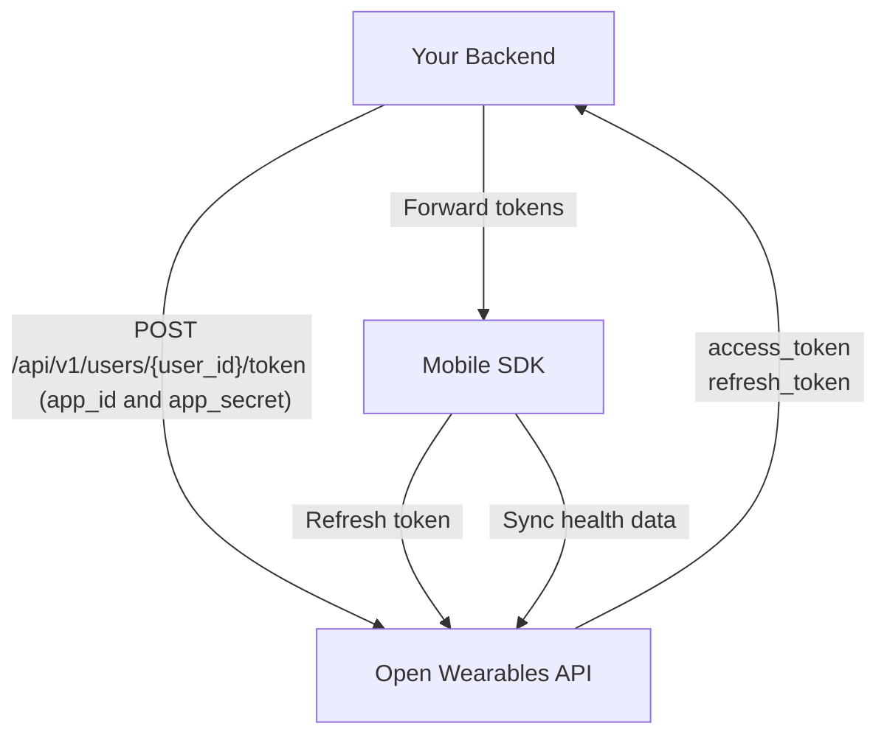

## Overview

This guide walks you through the complete integration of the Open Wearables Android SDK into a native Kotlin application, from backend setup to production deployment.

<Steps>
  <Step title="Set up backend authentication endpoint" />
  <Step title="Initialize and configure the SDK" />
  <Step title="Implement sign-in flow" />
  <Step title="Select health provider" />
  <Step title="Request health permissions" />
  <Step title="Start background sync" />
</Steps>

## Authentication Architecture

The SDK supports two authentication modes: **token-based** (recommended) and **API key**. The token-based flow keeps your App credentials safe on your backend:

<Steps>
  <Step title="Your Backend generates token" icon="server">
    Your backend calls the Open Wearables API with your **App credentials** (`app_id` + `app_secret`) to generate a user-scoped token (server-to-server, HTTPS) via [Create User Token](/api-reference/mobile-sdk/create-user-token) endpoint. Open Wearables returns `access_token` + `refresh_token`.
  </Step>
  <Step title="Your Backend returns tokens to the app" icon="key">
    Your backend exposes its own custom endpoint that forwards the `access_token` and `refresh_token` to the mobile app. **Never expose `app_id` or `app_secret` to the client.**
  </Step>
  <Step title="Mobile App calls SDK signIn" icon="mobile">
    The Android app receives the tokens and passes them to `sdk.signIn(accessToken, refreshToken)`.
  </Step>
  <Step title="SDK stores & syncs" icon="lock">
    Android SDK stores credentials in EncryptedSharedPreferences and uses `accessToken` to sync health data directly to Open Wearables.
  </Step>
</Steps>



<Warning>
  **Never embed your `app_id` / `app_secret` in the mobile app.** App credentials should only exist on your backend server. Only the `access_token` and `refresh_token` are passed to the mobile app.
</Warning>

## Step 1: Backend Setup

Your backend needs a single endpoint that generates access tokens for your users by calling the Open Wearables API and forwarding the tokens.

### Generate Access Token

When a user wants to connect their health data, your backend should:

1. Authenticate the user (your own auth system)
2. Call Open Wearables API at [`POST /api/v1/users/{user_id}/token`](/api-reference/mobile-sdk/create-user-token) with your App credentials
3. Return the `access_token` and `refresh_token` to the mobile app

<Tabs>
  <Tab title="Node.js">
```javascript
// Express.js example — runs on YOUR backend (e.g. https://api.yourapp.com)
const express = require('express');
const app = express();

app.post('/api/health/connect', authenticateUser, async (req, res) => {
  try {
    const owUserId = req.user.openWearablesUserId;
    
    // Call Open Wearables API to generate a user-scoped token
    const response = await fetch(
      `${process.env.OPENWEARABLES_HOST}/api/v1/users/${owUserId}/token`,
      {
        method: 'POST',
        headers: { 'Content-Type': 'application/json' },
        body: JSON.stringify({
          app_id: process.env.OPENWEARABLES_APP_ID,
          app_secret: process.env.OPENWEARABLES_APP_SECRET,
        }),
      }
    );
    
    if (!response.ok) {
      throw new Error('Failed to generate token');
    }
    
    const { access_token, refresh_token } = await response.json();
    
    // Return tokens to the mobile app (NOT the app credentials!)
    res.json({ 
      userId: owUserId, 
      accessToken: access_token,
      refreshToken: refresh_token,
    });
  } catch (error) {
    console.error('Health connect error:', error);
    res.status(500).json({ error: 'Failed to connect health' });
  }
});
```
  </Tab>

  <Tab title="Python">
```python
# FastAPI example — runs on YOUR backend (e.g. https://api.yourapp.com)
from fastapi import FastAPI, Depends, HTTPException
import httpx
import os

app = FastAPI()

@app.post("/api/health/connect")
async def connect_health(current_user = Depends(get_current_user)):
    ow_user_id = current_user.open_wearables_user_id

    # Call Open Wearables API to generate a user-scoped token
    async with httpx.AsyncClient() as client:
        response = await client.post(
            f"{os.environ['OPENWEARABLES_HOST']}/api/v1/users/{ow_user_id}/token",
            json={
                "app_id": os.environ["OPENWEARABLES_APP_ID"],
                "app_secret": os.environ["OPENWEARABLES_APP_SECRET"],
            },
        )
        
        if response.status_code != 200:
            raise HTTPException(500, "Failed to generate token")
        
        data = response.json()
    
    # Return tokens to the mobile app
    return {
        "userId": str(ow_user_id),
        "accessToken": data["access_token"],
        "refreshToken": data["refresh_token"],
    }
```
  </Tab>

  <Tab title="Ruby">
```ruby
# Rails controller example — runs on YOUR backend (e.g. https://api.yourapp.com)
class HealthController < ApplicationController
  before_action :authenticate_user!

  def connect
    ow_user_id = current_user.open_wearables_user_id

    # Call Open Wearables API to generate a user-scoped token
    response = HTTParty.post(
      "#{ENV['OPENWEARABLES_HOST']}/api/v1/users/#{ow_user_id}/token",
      headers: { 'Content-Type' => 'application/json' },
      body: {
        app_id: ENV['OPENWEARABLES_APP_ID'],
        app_secret: ENV['OPENWEARABLES_APP_SECRET']
      }.to_json
    )

    if response.success?
      # Return tokens to the mobile app
      render json: {
        userId: ow_user_id,
        accessToken: response['access_token'],
        refreshToken: response['refresh_token']
      }
    else
      render json: { error: 'Failed to connect' }, status: 500
    end
  end
end
```
  </Tab>
</Tabs>

<Note>
  The `user_id` in the URL is the Open Wearables User ID (UUID). You should store this mapping in your database when you first [Create User](/api-reference/users/create-user) via the Open Wearables API.
</Note>

## Step 2: SDK Initialization & Configuration

Initialize the SDK once in your `Application` class or main activity, then configure it with your backend host.

```kotlin
import com.openwearables.health.sdk.OpenWearablesHealthSDK

class MyApplication : Application() {

    override fun onCreate() {
        super.onCreate()

        // Initialize SDK (once per app lifecycle)
        val sdk = OpenWearablesHealthSDK.initialize(this)

        // Optional: Set up logging
        sdk.logListener = { message ->
            Log.d("HealthSDK", message)
        }

        // Optional: Set log level (default is OWLogLevel.DEBUG — logs only in debuggable builds)
        sdk.logLevel = OWLogLevel.ALWAYS

        // Optional: Handle auth errors (e.g. token expired)
        sdk.authErrorListener = { error ->
            Log.e("HealthSDK", "Auth error: $error")
        }

        // Configure with your backend host
        sdk.configure(host = "https://api.openwearables.io")
    }
}
```

### Configuration Options

| Parameter | Type | Description |
|-----------|------|-------------|
| `host` | `String` | **Required.** The Open Wearables API base URL (host only, without path suffix) |

<Info>
  Provide only the base host URL, e.g. `https://your-domain.com`. Do **not** append `/api/v1/` or any other path — the SDK adds the required path prefix automatically.
</Info>

```kotlin
// For self-hosted Open Wearables
sdk.configure(host = "https://your-domain.com")
```

### Session Restoration

The SDK automatically restores credentials from EncryptedSharedPreferences:

```kotlin
val sdk = OpenWearablesHealthSDK.getInstance()

if (sdk.isSessionValid()) {
    val userId = sdk.restoreSession()
    Log.d("HealthSDK", "Session restored for user: $userId")
} else {
    // Need to sign in
}
```

## Step 3: Sign In

After getting credentials from your backend, sign in with the SDK.

<Info>
  The `userId` parameter is the **Open Wearables User ID** (UUID) — the `id` returned by the [Create User](/api-reference/users/create-user) endpoint. Do **not** pass your own `external_user_id` here.
</Info>

### Token-Based Authentication (Recommended)

```kotlin
suspend fun connectHealth(credentials: HealthCredentials) {
    val sdk = OpenWearablesHealthSDK.getInstance()

    sdk.signIn(
        userId = credentials.userId,
        accessToken = credentials.accessToken,
        refreshToken = credentials.refreshToken,
        apiKey = null
    )

    Log.d("HealthSDK", "Signed in: ${credentials.userId}")
}
```

### API Key Authentication

For simpler setups (e.g. internal tools):

```kotlin
sdk.signIn(
    userId = "user123",
    accessToken = null,
    refreshToken = null,
    apiKey = "your_api_key"
)
```

<Warning>
  API key authentication embeds the key in the app. Only use this for internal or trusted applications. For production apps, always use token-based authentication.
</Warning>

### Automatic Token Refresh

When you provide a `refreshToken`, the SDK automatically handles 401 responses by refreshing the access token and retrying the request.

You can also update tokens manually:

```kotlin
sdk.updateTokens(
    accessToken = newAccessToken,
    refreshToken = newRefreshToken
)
```

## Step 4: Select Health Provider

Before requesting permissions, you must select a health data provider:

```kotlin
val sdk = OpenWearablesHealthSDK.getInstance()

// Check available providers
val providers = sdk.getAvailableProviders()
for (p in providers) {
    Log.d("HealthSDK", "${p["displayName"]} (${p["id"]}) - available: ${p["isAvailable"]}")
}

// Set the provider based on user selection or your default
val success = sdk.setProvider("google") // or "samsung" for Samsung Health
if (!success) {
    Log.e("HealthSDK", "Selected provider is unavailable on this device")
}
```

<Note>
  Call `setProvider()` before `requestAuthorization()`. The SDK needs to know which provider to request permissions from.
</Note>

### Provider Comparison

| Feature | Health Connect (`"google"`) | Samsung Health (`"samsung"`) |
|---------|---------------------------|------------------------------|
| Device support | All Android 10+ | Samsung devices only |
| Data types | 25+ types | 16 types |
| Pre-installed | Android 14+ | Samsung devices |
| Install required | Play Store (Android < 14) | Samsung Health app |

<Tip>
  Health Connect is recommended as the default provider for the widest device and data type support.
</Tip>

## Step 5: Request Permissions

Request access to specific health data types. The type IDs are string-based:

```kotlin
suspend fun requestHealthPermissions(): Boolean {
    val sdk = OpenWearablesHealthSDK.getInstance()

    val authorized = sdk.requestAuthorization(
        types = listOf(
            "steps",
            "heartRate",
            "restingHeartRate",
            "sleep",
            "workout",
            "activeEnergy",
            "bodyMass"
        )
    )

    if (authorized) {
        Log.d("HealthSDK", "Health permissions granted")
    } else {
        Log.d("HealthSDK", "Some permissions were denied")
    }

    return authorized
}
```

<Note>
  Make sure to call `setActivity()` on the SDK before requesting authorization, so the SDK can launch the permission dialog from the correct Activity context.
</Note>

## Step 6: Start Background Sync

Enable background sync to keep data flowing even when your app is in the background:

```kotlin
suspend fun startSync() {
    val sdk = OpenWearablesHealthSDK.getInstance()
    sdk.startBackgroundSync()
    Log.d("HealthSDK", "Background sync started: ${sdk.isSyncActive()}")
}
```

### Controlling Sync History Depth

By default, the SDK syncs all available historical data on the first sync. Use the `syncDaysBack` parameter to limit how far back the sync goes:

```kotlin
// Sync only the last 90 days of data
sdk.startBackgroundSync(syncDaysBack = 90)

// Sync last 30 days
sdk.startBackgroundSync(syncDaysBack = 30)

// Full sync — all available history (default)
sdk.startBackgroundSync()
```

| Parameter | Type | Default | Description |
|-----------|------|---------|-------------|
| `syncDaysBack` | `Int?` | `null` | Number of days of historical data to sync. Syncs from the start of the day that many days ago. When `null`, syncs all available history. The value is persisted and used for subsequent background syncs until changed. |

### Background Sync Behavior

| Mechanism | Description |
|-----------|-------------|
| WorkManager | Periodic background sync with system-managed scheduling |
| Foreground Service | Used during active sync for reliability (`dataSync` type) |
| Notification | Shows a notification during active sync (Android 13+ requires permission) |

### Manual Sync

Trigger an immediate sync:

```kotlin
sdk.syncNow()
```

### Stop Sync

```kotlin
sdk.stopBackgroundSync()
```

### Log Level

Control SDK log output using the `logLevel` property. By default, the SDK uses `OWLogLevel.DEBUG`, which outputs logs only in debuggable builds:

```kotlin
val sdk = OpenWearablesHealthSDK.getInstance()

// Always show logs (including release builds)
sdk.logLevel = OWLogLevel.ALWAYS

// Only show logs in debuggable builds (default)
sdk.logLevel = OWLogLevel.DEBUG

// Disable all logs
sdk.logLevel = OWLogLevel.NONE
```

| Level | Description |
|-------|-------------|
| `OWLogLevel.NONE` | No logs at all |
| `OWLogLevel.ALWAYS` | Logs are always emitted (Logcat + listener) regardless of build type |
| `OWLogLevel.DEBUG` | Logs are emitted only in debuggable builds (default) |

<Tip>
  Set `OWLogLevel.ALWAYS` during development or when troubleshooting sync issues in production. Switch to `OWLogLevel.NONE` if you want to suppress all SDK output.
</Tip>

### Lifecycle Management

Notify the SDK of app lifecycle changes for optimal sync behavior:

```kotlin
class MainActivity : AppCompatActivity() {

    override fun onResume() {
        super.onResume()
        OpenWearablesHealthSDK.getInstance().onForeground()
    }

    override fun onPause() {
        super.onPause()
        OpenWearablesHealthSDK.getInstance().onBackground()
    }
}
```

## Complete Integration Example

Here's a complete ViewModel showing the full integration:

```kotlin
import androidx.lifecycle.ViewModel
import androidx.lifecycle.viewModelScope
import com.openwearables.health.sdk.OpenWearablesHealthSDK
import kotlinx.coroutines.flow.MutableStateFlow
import kotlinx.coroutines.flow.StateFlow
import kotlinx.coroutines.launch

class HealthViewModel : ViewModel() {

    private val sdk = OpenWearablesHealthSDK.getInstance()

    private val _isConnected = MutableStateFlow(false)
    val isConnected: StateFlow<Boolean> = _isConnected

    private val _isSyncing = MutableStateFlow(false)
    val isSyncing: StateFlow<Boolean> = _isSyncing

    init {
        _isConnected.value = sdk.isSessionValid()
        _isSyncing.value = sdk.isSyncActive()
    }

    fun connect(userId: String, accessToken: String, refreshToken: String?) {
        viewModelScope.launch {
            try {
                // Sign in
                sdk.signIn(
                    userId = userId,
                    accessToken = accessToken,
                    refreshToken = refreshToken,
                    apiKey = null
                )

                // Set provider
                sdk.setProvider("google")

                // Request permissions
                val authorized = sdk.requestAuthorization(
                    types = listOf(
                        "steps", "heartRate", "sleep",
                        "workout", "activeEnergy"
                    )
                )

                if (authorized) {
                    sdk.startBackgroundSync(syncDaysBack = 90)
                }
            } catch (e: Exception) {
                Log.e("HealthSDK", "Connection failed", e)
            }
        }
    }

    fun disconnect() {
        viewModelScope.launch {
            sdk.stopBackgroundSync()
            sdk.signOut()
            _isConnected.value = false
            _isSyncing.value = false
        }
    }

    fun syncNow() {
        viewModelScope.launch {
            sdk.syncNow()
        }
    }

    fun checkAndResumeSync() {
        viewModelScope.launch {
            if (sdk.hasResumableSyncSession()) {
                val status = sdk.getSyncStatus()
                Log.d("HealthSDK", "Resuming sync, sent: ${status["sentCount"]}")
                sdk.resumeSync()
            }
        }
    }

    fun resyncAllData() {
        viewModelScope.launch {
            sdk.resetAnchors()
            sdk.syncNow()
        }
    }

    override fun onCleared() {
        super.onCleared()
        sdk.destroy()
    }
}
```

### Using the ViewModel

```kotlin
class HealthActivity : AppCompatActivity() {

    private val viewModel: HealthViewModel by viewModels()

    override fun onCreate(savedInstanceState: Bundle?) {
        super.onCreate(savedInstanceState)

        val sdk = OpenWearablesHealthSDK.getInstance()
        sdk.setActivity(this)

        // Observe state
        lifecycleScope.launch {
            viewModel.isConnected.collect { connected ->
                updateUI(connected)
            }
        }

        // Check for interrupted syncs
        viewModel.checkAndResumeSync()

        connectButton.setOnClickListener {
            val credentials = getCredentialsFromBackend()
            viewModel.connect(
                userId = credentials.userId,
                accessToken = credentials.accessToken,
                refreshToken = credentials.refreshToken
            )
        }

        disconnectButton.setOnClickListener {
            viewModel.disconnect()
        }

        syncNowButton.setOnClickListener {
            viewModel.syncNow()
        }
    }

    override fun onDestroy() {
        super.onDestroy()
        OpenWearablesHealthSDK.getInstance().setActivity(null)
    }
}
```

## Data Sync Endpoint

The SDK sends health data to:

```
POST {host}/api/v1/sdk/users/{userId}/sync
```

The payload includes a `provider` field (`"samsung"` or `"google"`) and the SDK version:

```json
{
  "provider": "google",
  "sdkVersion": "0.5.0",
  "syncTimestamp": "2025-01-15T10:30:00Z",
  "data": {
    "records": [...],
    "workouts": [...],
    "sleep": [...]
  }
}
```

Data is automatically normalized to the Open Wearables unified data model and can be accessed through the standard API endpoints.

## Next Steps

<CardGroup cols={2}>
  <Card title="Troubleshooting" icon="wrench" href="/sdk/android/troubleshooting">
    Common issues and solutions for Android.
  </Card>
  <Card title="Data Types" icon="database" href="/architecture/data-types">
    Available health metrics and data formats.
  </Card>
</CardGroup>
