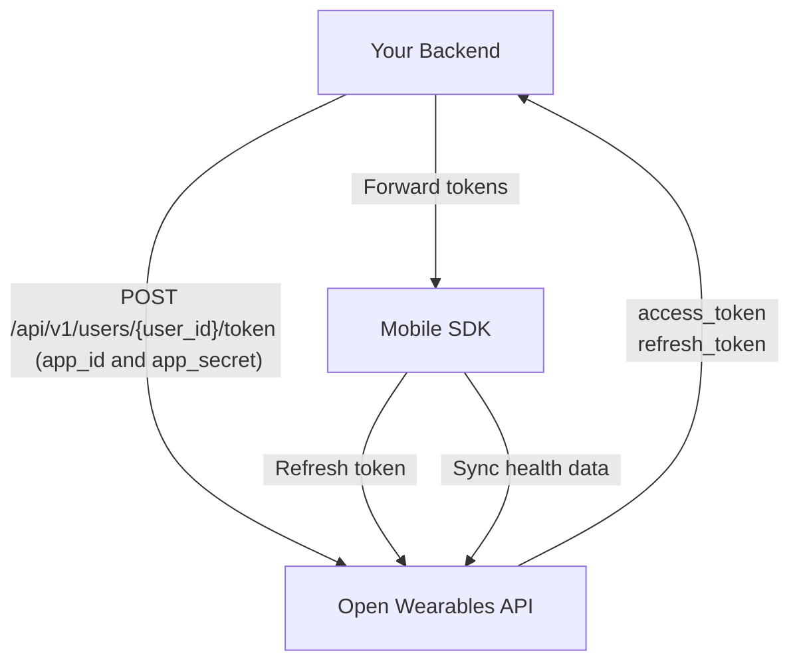

## Overview

This guide walks you through the complete integration of the Open Wearables Flutter SDK, from backend setup to production deployment.

<Steps>
  <Step title="Set up backend authentication endpoint" />
  <Step title="Configure the SDK in your Flutter app" />
  <Step title="Implement sign-in flow" />
  <Step title="Request health permissions" />
  <Step title="Start background sync" />
</Steps>

## Authentication Architecture

The SDK supports two authentication modes: **token-based** (recommended) and **API key**. The token-based flow keeps your App credentials safe on your backend:

<Steps>
  <Step title="Your Backend generates token" icon="server">
    Your backend calls the Open Wearables API with your **App credentials** (`app_id` + `app_secret`) to generate a user-scoped token (server-to-server, HTTPS) via [Create User Token](/api-reference/mobile-sdk/create-user-token) endpoint. Open Wearables returns `access_token` + `refresh_token`.
  </Step>
  <Step title="Your Backend returns tokens to the app" icon="key">
    Your backend exposes its own custom endpoint that forwards the `access_token` and `refresh_token` to the mobile app. **Never expose `app_id` or `app_secret` to the client.**
  </Step>
  <Step title="Mobile App calls SDK signIn" icon="mobile">
    The Flutter app receives the tokens and passes them to `OpenWearablesHealthSdk.signIn(accessToken, refreshToken)`.
  </Step>
  <Step title="SDK stores & syncs" icon="lock">
    Flutter SDK stores credentials in iOS Keychain / Android EncryptedSharedPreferences and uses `accessToken` to sync health data directly to Open Wearables.
  </Step>
</Steps>



<Warning>
  **Never embed your `app_id` / `app_secret` in the mobile app.** App credentials should only exist on your backend server. Only the `access_token` and `refresh_token` are passed to the mobile app.
</Warning>

## Step 1: Backend Setup

Your backend needs a single endpoint that generates access tokens for your users by calling the Open Wearables API and forwarding the tokens.

### Generate Access Token

When a user wants to connect their health data, your backend should:

1. Authenticate the user (your own auth system)
2. Call Open Wearables API at [`POST /api/v1/users/{user_id}/token`](/api-reference/mobile-sdk/create-user-token) with your App credentials
3. Return the `access_token` and `refresh_token` to the mobile app

<Tabs>
  <Tab title="Node.js">
```javascript
// Express.js example — runs on YOUR backend (e.g. https://api.yourapp.com)
const express = require('express');
const app = express();

app.post('/api/health/connect', authenticateUser, async (req, res) => {
  try {
    const owUserId = req.user.openWearablesUserId;
    
    // Call Open Wearables API to generate a user-scoped token
    const response = await fetch(
      `${process.env.OPENWEARABLES_HOST}/api/v1/users/${owUserId}/token`,
      {
        method: 'POST',
        headers: { 'Content-Type': 'application/json' },
        body: JSON.stringify({
          app_id: process.env.OPENWEARABLES_APP_ID,
          app_secret: process.env.OPENWEARABLES_APP_SECRET,
        }),
      }
    );
    
    if (!response.ok) {
      throw new Error('Failed to generate token');
    }
    
    const { access_token, refresh_token } = await response.json();
    
    // Return tokens to the mobile app (NOT the app credentials!)
    res.json({ 
      userId: owUserId, 
      accessToken: access_token,
      refreshToken: refresh_token,
    });
  } catch (error) {
    console.error('Health connect error:', error);
    res.status(500).json({ error: 'Failed to connect health' });
  }
});
```
  </Tab>

  <Tab title="Python">
```python
# FastAPI example — runs on YOUR backend (e.g. https://api.yourapp.com)
from fastapi import FastAPI, Depends, HTTPException
import httpx
import os

app = FastAPI()

@app.post("/api/health/connect")
async def connect_health(current_user = Depends(get_current_user)):
    ow_user_id = current_user.open_wearables_user_id

    # Call Open Wearables API to generate a user-scoped token
    async with httpx.AsyncClient() as client:
        response = await client.post(
            f"{os.environ['OPENWEARABLES_HOST']}/api/v1/users/{ow_user_id}/token",
            json={
                "app_id": os.environ["OPENWEARABLES_APP_ID"],
                "app_secret": os.environ["OPENWEARABLES_APP_SECRET"],
            },
        )
        
        if response.status_code != 200:
            raise HTTPException(500, "Failed to generate token")
        
        data = response.json()
    
    # Return tokens to the mobile app
    return {
        "userId": str(ow_user_id),
        "accessToken": data["access_token"],
        "refreshToken": data["refresh_token"],
    }
```
  </Tab>

  <Tab title="Ruby">
```ruby
# Rails controller example — runs on YOUR backend (e.g. https://api.yourapp.com)
class HealthController < ApplicationController
  before_action :authenticate_user!

  def connect
    ow_user_id = current_user.open_wearables_user_id

    # Call Open Wearables API to generate a user-scoped token
    response = HTTParty.post(
      "#{ENV['OPENWEARABLES_HOST']}/api/v1/users/#{ow_user_id}/token",
      headers: { 'Content-Type' => 'application/json' },
      body: {
        app_id: ENV['OPENWEARABLES_APP_ID'],
        app_secret: ENV['OPENWEARABLES_APP_SECRET']
      }.to_json
    )

    if response.success?
      # Return tokens to the mobile app
      render json: {
        userId: ow_user_id,
        accessToken: response['access_token'],
        refreshToken: response['refresh_token']
      }
    else
      render json: { error: 'Failed to connect' }, status: 500
    end
  end
end
```
  </Tab>
</Tabs>

<Note>
  The `user_id` in the URL is the Open Wearables User ID (UUID). You should store this mapping in your database when you first [Create User](/api-reference/users/create-user) via the Open Wearables API.
</Note>

## Step 2: SDK Configuration

Configure the SDK once at app startup, typically in your main initialization code.

```dart
import 'package:open_wearables_health_sdk/open_wearables_health_sdk.dart';

Future<void> main() async {
  WidgetsFlutterBinding.ensureInitialized();
  
  // Configure SDK with your backend host - this also restores any existing session
  await OpenWearablesHealthSdk.configure(
    host: 'https://api.openwearables.io',
  );
  
  runApp(MyApp());
}
```

### Configuration Options

| Parameter | Type | Description |
|-----------|------|-------------|
| `host` | `String` | **Required.** The Open Wearables API base URL — host only, without path suffix (e.g. `https://api.openwearables.io`) |

<Info>
  Provide only the base host URL, e.g. `https://your-domain.com`. Do **not** append `/api/v1/` or any other path — the SDK adds the required path prefix automatically.
</Info>

```dart
// For self-hosted Open Wearables
await OpenWearablesHealthSdk.configure(
  host: 'https://your-domain.com',
);
```

### Session Restoration

The SDK automatically restores the user session from secure storage when `configure()` is called:

```dart
await OpenWearablesHealthSdk.configure(host: 'https://api.openwearables.io');

// Check if user was previously signed in
if (OpenWearablesHealthSdk.isSignedIn) {
  print('Welcome back, ${OpenWearablesHealthSdk.currentUser?.userId}!');
  // User is already signed in, can start sync directly
} else {
  // Need to sign in first
}
```

## Step 3: Sign In

After getting credentials from your backend, sign in with the SDK:

<Info>
  The `userId` parameter is the **Open Wearables User ID** (UUID) — the `id` returned by the [Create User](/api-reference/users/create-user) endpoint. Do **not** pass your own `external_user_id` here.
</Info>

### Token-Based Authentication (Recommended)

```dart
Future<void> connectHealth() async {
  try {
    // 1. Get tokens from YOUR backend (e.g. https://api.yourapp.com)
    final response = await yourApi.post('/api/health/connect');
    final credentials = json.decode(response.body);
    
    // 2. Sign in with the SDK
    final user = await OpenWearablesHealthSdk.signIn(
      userId: credentials['userId'],
      accessToken: credentials['accessToken'],
      refreshToken: credentials['refreshToken'],
    );
    
    print('Connected: ${user.userId}');
  } on SignInException catch (e) {
    print('Sign-in failed: ${e.message} (status: ${e.statusCode})');
  }
}
```

### API Key Authentication

For simpler setups (e.g. internal tools), you can use API key authentication directly:

```dart
final user = await OpenWearablesHealthSdk.signIn(
  userId: 'user123',
  apiKey: 'your_api_key',
);
```

<Warning>
  API key authentication embeds the key in the app. Only use this for internal or trusted applications. For production apps, always use token-based authentication.
</Warning>

### Automatic Token Refresh

When you provide a `refreshToken`, the SDK automatically handles 401 responses by refreshing the access token and retrying the request.

You can also update tokens manually:

```dart
await OpenWearablesHealthSdk.updateTokens(
  accessToken: newAccessToken,
  refreshToken: newRefreshToken,
);
```

## Step 4: Request Permissions

Request access to specific health data types:

```dart
Future<bool> requestHealthPermissions() async {
  final authorized = await OpenWearablesHealthSdk.requestAuthorization(
    types: [
      HealthDataType.steps,
      HealthDataType.heartRate,
      HealthDataType.restingHeartRate,
      HealthDataType.sleep,
      HealthDataType.workout,
      HealthDataType.activeEnergy,
      HealthDataType.bodyMass,
    ],
  );
  
  if (authorized) {
    print('Health permissions granted');
  } else {
    print('Some permissions were denied');
  }
  
  return authorized;
}
```

### Android Provider Selection

On Android, you must select a health data provider before requesting authorization:

```dart
import 'dart:io';
import 'package:shared_preferences/shared_preferences.dart';

Future<AndroidHealthProvider> selectAndroidProvider() async {
  final prefs = await SharedPreferences.getInstance();
  final savedProvider = prefs.getString('health_provider');

  // Restore previously chosen provider if still available
  final providers = await OpenWearablesHealthSdk.getAvailableProviders();

  if (savedProvider != null) {
    final restored = providers.cast<AndroidHealthProvider?>().firstWhere(
      (p) => p?.name == savedProvider,
      orElse: () => null,
    );
    if (restored != null) return restored;
  }

  // Prefer Health Connect, fall back to Samsung Health
  final AndroidHealthProvider chosen;
  if (providers.contains(AndroidHealthProvider.healthConnect)) {
    chosen = AndroidHealthProvider.healthConnect;
  } else if (providers.contains(AndroidHealthProvider.samsungHealth)) {
    chosen = AndroidHealthProvider.samsungHealth;
  } else {
    throw Exception(
      'No supported health provider found. '
      'Please install Health Connect or Samsung Health.',
    );
  }

  await prefs.setString('health_provider', chosen.name);
  return chosen;
}

// Usage
if (Platform.isAndroid) {
  final provider = await selectAndroidProvider();
  await OpenWearablesHealthSdk.setProvider(provider);
}

// Then request authorization
final authorized = await OpenWearablesHealthSdk.requestAuthorization(
  types: [
    HealthDataType.steps,
    HealthDataType.heartRate,
    HealthDataType.sleep,
    HealthDataType.workout,
    HealthDataType.activeEnergy,
  ],
);
print('Permissions granted: $authorized');
```

<Note>
  On iOS, users can grant partial permissions. The SDK will sync whatever data the user allows.
</Note>

<Tip>
  Request only the data types you actually need. Requesting too many types can overwhelm users and reduce acceptance rates.
</Tip>

## Step 5: Start Background Sync

Enable background sync to keep data flowing even when your app is in the background:

```dart
await OpenWearablesHealthSdk.startBackgroundSync();

// Check sync status
print('Sync active: ${OpenWearablesHealthSdk.isSyncActive}');
```

### Controlling Sync History Depth

By default, the SDK syncs all available historical data on the first sync. Use the `syncDaysBack` parameter to limit how far back the sync goes:

```dart
// Sync only the last 90 days of data
await OpenWearablesHealthSdk.startBackgroundSync(syncDaysBack: 90);

// Sync last 30 days
await OpenWearablesHealthSdk.startBackgroundSync(syncDaysBack: 30);

// Full sync — all available history (default)
await OpenWearablesHealthSdk.startBackgroundSync();
```

| Parameter | Type | Default | Description |
|-----------|------|---------|-------------|
| `syncDaysBack` | `int?` | `null` | Number of days of historical data to sync. Syncs from the start of the day that many days ago. When `null`, syncs all available history. The value is persisted and used for subsequent background syncs until changed. |

### Background Sync Behavior

<Tabs>
  <Tab title="iOS">
    | Mechanism | Frequency |
    |-----------|-----------|
    | HealthKit Observer Queries | Immediate on new data |
    | BGAppRefreshTask | Every ~15 minutes (system-managed) |
    | BGProcessingTask | Network-required background processing |
  </Tab>
  <Tab title="Android">
    | Mechanism | Frequency |
    |-----------|-----------|
    | WorkManager | Periodic sync with foreground service |
    | Foreground Service | Used during active sync for reliability |
  </Tab>
</Tabs>

<Warning>
  Background sync frequency is managed by the OS and may vary based on battery level, network conditions, and user behavior.
</Warning>

### Manual Sync

Trigger an immediate sync when needed:

```dart
await OpenWearablesHealthSdk.syncNow();
```

### Log Level

Control SDK log output using `setLogLevel`. By default, the SDK uses `OWLogLevel.debug`, which prints logs only in debug builds:

```dart
// Always show logs (including release builds)
await OpenWearablesHealthSdk.setLogLevel(OWLogLevel.always);

// Only show logs in debug builds (default)
await OpenWearablesHealthSdk.setLogLevel(OWLogLevel.debug);

// Disable all logs
await OpenWearablesHealthSdk.setLogLevel(OWLogLevel.none);
```

| Level | Description |
|-------|-------------|
| `OWLogLevel.none` | No logs at all |
| `OWLogLevel.always` | Logs are always printed regardless of build mode |
| `OWLogLevel.debug` | Logs are printed only in debug builds (default) |

<Tip>
  Set `OWLogLevel.always` during development or when troubleshooting sync issues in production. Switch to `OWLogLevel.none` if you want to suppress all SDK output.
</Tip>

## Complete Integration Example

Here's a complete service class showing the full integration:

```dart
import 'dart:convert';
import 'dart:io';
import 'package:open_wearables_health_sdk/open_wearables_health_sdk.dart';
import 'package:open_wearables_health_sdk/open_wearables_health_sdk_method_channel.dart';
import 'package:http/http.dart' as http;
import 'package:shared_preferences/shared_preferences.dart';

class HealthSyncService {
  final String _backendUrl;
  final String _authToken;

  HealthSyncService({
    required String backendUrl,
    required String authToken,
  })  : _backendUrl = backendUrl,
        _authToken = authToken;

  /// Initialize the health sync service
  Future<void> initialize() async {
    // Set up event listeners
    MethodChannelOpenWearablesHealthSdk.logStream.listen((message) {
      print('[HealthSync] $message');
    });

    MethodChannelOpenWearablesHealthSdk.authErrorStream.listen((error) {
      print('[HealthSync] Auth error: ${error['statusCode']}');
    });

    await OpenWearablesHealthSdk.configure(
      host: 'https://api.openwearables.io',
    );

    // Enable logs in all builds for debugging (default is debug-only)
    await OpenWearablesHealthSdk.setLogLevel(OWLogLevel.always);
  }

  /// Get current status
  OpenWearablesHealthSdkStatus get status => OpenWearablesHealthSdk.status;
  bool get isConnected => OpenWearablesHealthSdk.isSignedIn;
  bool get isSyncing => OpenWearablesHealthSdk.isSyncActive;

  /// Connect health data for the current user
  Future<void> connect() async {
    switch (OpenWearablesHealthSdk.status) {
      case OpenWearablesHealthSdkStatus.signedIn:
        if (!OpenWearablesHealthSdk.isSyncActive) {
          await _startSync();
        }
        return;

      case OpenWearablesHealthSdkStatus.configured:
        await _signIn();
        await _startSync();
        return;

      case OpenWearablesHealthSdkStatus.notConfigured:
        throw Exception('SDK not configured. Call initialize() first.');
    }
  }

  Future<void> _signIn() async {
    // Call YOUR backend — not the Open Wearables API directly
    final response = await http.post(
      Uri.parse('$_backendUrl/api/health/connect'),
      headers: {
        'Authorization': 'Bearer $_authToken',
        'Content-Type': 'application/json',
      },
    );

    if (response.statusCode != 200) {
      throw Exception('Failed to get health credentials');
    }

    final data = json.decode(response.body);

    await OpenWearablesHealthSdk.signIn(
      userId: data['userId'],
      accessToken: data['accessToken'],
      refreshToken: data['refreshToken'],
    );
  }

  Future<void> _startSync() async {
    if (Platform.isAndroid) {
      final providers = await OpenWearablesHealthSdk.getAvailableProviders();

      final prefs = await SharedPreferences.getInstance();
      final savedName = prefs.getString('health_provider');

      // Restore saved provider or pick the best available one
      AndroidHealthProvider? chosen;
      if (savedName != null) {
        chosen = providers.cast<AndroidHealthProvider?>().firstWhere(
          (p) => p?.name == savedName,
          orElse: () => null,
        );
      }
      chosen ??= providers.contains(AndroidHealthProvider.healthConnect)
          ? AndroidHealthProvider.healthConnect
          : providers.contains(AndroidHealthProvider.samsungHealth)
              ? AndroidHealthProvider.samsungHealth
              : null;

      if (chosen == null) {
        throw Exception(
          'No supported health provider available on this device. '
          'Please install Health Connect or Samsung Health.',
        );
      }

      await prefs.setString('health_provider', chosen.name);
      await OpenWearablesHealthSdk.setProvider(chosen);
    }

    final authorized = await OpenWearablesHealthSdk.requestAuthorization(
      types: [
        HealthDataType.steps,
        HealthDataType.heartRate,
        HealthDataType.sleep,
        HealthDataType.workout,
        HealthDataType.activeEnergy,
      ],
    );

    if (!authorized) {
      throw Exception('Health permissions not granted');
    }

    await OpenWearablesHealthSdk.startBackgroundSync(syncDaysBack: 90);
  }

  /// Disconnect health data
  Future<void> disconnect() async {
    await OpenWearablesHealthSdk.stopBackgroundSync();
    await OpenWearablesHealthSdk.signOut();
  }

  /// Check for interrupted sync sessions
  Future<void> checkAndResumeSync() async {
    final status = await OpenWearablesHealthSdk.getSyncStatus();
    
    if (status['hasResumableSession'] == true) {
      print('Resuming interrupted sync...');
      print('Already sent: ${status['sentCount']} records');
      await OpenWearablesHealthSdk.resumeSync();
    }
  }

  /// Force a full re-sync of all data
  Future<void> resyncAllData() async {
    await OpenWearablesHealthSdk.resetAnchors();
    await OpenWearablesHealthSdk.syncNow();
  }
}
```

### Using the Service

```dart
class MyApp extends StatefulWidget {
  @override
  _MyAppState createState() => _MyAppState();
}

class _MyAppState extends State<MyApp> {
  late HealthSyncService _healthService;

  @override
  void initState() {
    super.initState();
    _initializeHealth();
  }

  Future<void> _initializeHealth() async {
    _healthService = HealthSyncService(
      backendUrl: 'https://api.yourapp.com',
      authToken: await getAuthToken(),
    );

    await _healthService.initialize();
    
    // Check for interrupted syncs
    await _healthService.checkAndResumeSync();
  }

  Future<void> _connectHealth() async {
    try {
      await _healthService.connect();
      ScaffoldMessenger.of(context).showSnackBar(
        SnackBar(content: Text('Health connected!')),
      );
    } catch (e) {
      ScaffoldMessenger.of(context).showSnackBar(
        SnackBar(content: Text('Failed: $e')),
      );
    }
  }

  @override
  Widget build(BuildContext context) {
    return Scaffold(
      body: Center(
        child: ElevatedButton(
          onPressed: _connectHealth,
          child: Text(_healthService.isConnected 
            ? 'Health Connected' 
            : 'Connect Health'),
        ),
      ),
    );
  }
}
```

## Data Sync Endpoint

The SDK sends health data to:

<ParamField path="host" type="string" required>
  Your Open Wearables API base URL (e.g. `https://api.example.com`).
</ParamField>

<ParamField path="userId" type="string" required>
  The user ID returned when registering the SDK user.
</ParamField>

```bash
POST {host}/api/v1/sdk/users/{userId}/sync
```

Data is automatically normalized to the Open Wearables unified data model and can be accessed through the standard API endpoints.

## Next Steps

<CardGroup cols={2}>
  <Card title="Troubleshooting" icon="wrench" href="/sdk/flutter/troubleshooting">
    Common issues and solutions for iOS and Android.
  </Card>
  <Card title="Data Types" icon="database" href="/architecture/data-types">
    Available health metrics and data formats.
  </Card>
</CardGroup>
