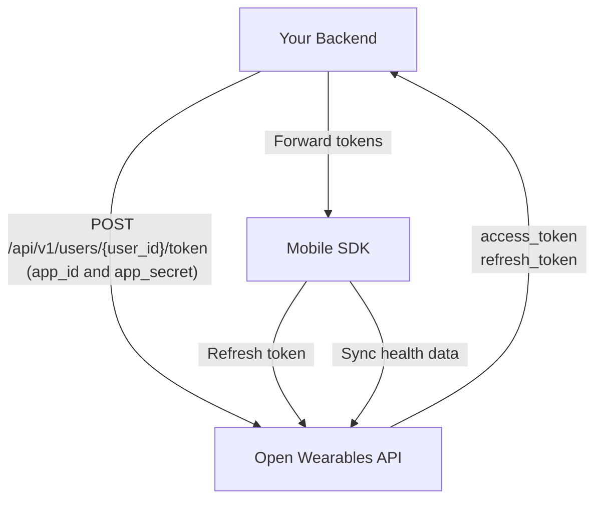

## Overview

This guide walks you through the complete integration of the Open Wearables iOS SDK into a native Swift application, from backend setup to production deployment.

<Steps>
  <Step title="Set up backend authentication endpoint" />
  <Step title="Configure the SDK in your iOS app" />
  <Step title="Implement sign-in flow" />
  <Step title="Request health permissions" />
  <Step title="Start background sync" />
</Steps>

## Authentication Architecture

The SDK supports two authentication modes: **token-based** (recommended) and **API key**. The token-based flow keeps your App credentials safe on your backend:

<Steps>
  <Step title="Your Backend generates token" icon="server">
    Your backend calls the Open Wearables API with your **App credentials** (`app_id` + `app_secret`) to generate a user-scoped token (server-to-server, HTTPS) via [Create User Token](/api-reference/mobile-sdk/create-user-token) endpoint. Open Wearables returns `access_token` + `refresh_token`.
  </Step>
  <Step title="Your Backend returns tokens to the app" icon="key">
    Your backend exposes its own custom endpoint that forwards the `access_token` and `refresh_token` to the mobile app. **Never expose `app_id` or `app_secret` to the client.**
  </Step>
  <Step title="Mobile App calls SDK signIn" icon="mobile">
    The iOS app receives the tokens and passes them to `sdk.signIn(accessToken:, refreshToken:)`.
  </Step>
  <Step title="SDK stores & syncs" icon="lock">
    iOS SDK stores credentials in Keychain and uses `accessToken` to sync health data directly to Open Wearables.
  </Step>
</Steps>



<Warning>
  **Never embed your `app_id` / `app_secret` in the mobile app.** App credentials should only exist on your backend server. Only the `access_token` and `refresh_token` are passed to the mobile app.
</Warning>

## Step 1: Backend Setup

Your backend needs a single endpoint that generates access tokens for your users by calling the Open Wearables API and forwarding the tokens.

### Generate Access Token

When a user wants to connect their health data, your backend should:

1. Authenticate the user (your own auth system)
2. Call Open Wearables API at [`POST /api/v1/users/{user_id}/token`](/api-reference/mobile-sdk/create-user-token) with your App credentials
3. Return the `access_token` and `refresh_token` to the mobile app

<Tabs>
  <Tab title="Node.js">
```javascript
// Express.js example — runs on YOUR backend (e.g. https://api.yourapp.com)
const express = require('express');
const app = express();

app.post('/api/health/connect', authenticateUser, async (req, res) => {
  try {
    const owUserId = req.user.openWearablesUserId;
    
    // Call Open Wearables API to generate a user-scoped token
    const response = await fetch(
      `${process.env.OPENWEARABLES_HOST}/api/v1/users/${owUserId}/token`,
      {
        method: 'POST',
        headers: { 'Content-Type': 'application/json' },
        body: JSON.stringify({
          app_id: process.env.OPENWEARABLES_APP_ID,
          app_secret: process.env.OPENWEARABLES_APP_SECRET,
        }),
      }
    );
    
    if (!response.ok) {
      throw new Error('Failed to generate token');
    }
    
    const { access_token, refresh_token } = await response.json();
    
    // Return tokens to the mobile app (NOT the app credentials!)
    res.json({ 
      userId: owUserId, 
      accessToken: access_token,
      refreshToken: refresh_token,
    });
  } catch (error) {
    console.error('Health connect error:', error);
    res.status(500).json({ error: 'Failed to connect health' });
  }
});
```
  </Tab>

  <Tab title="Python">
```python
# FastAPI example — runs on YOUR backend (e.g. https://api.yourapp.com)
from fastapi import FastAPI, Depends, HTTPException
import httpx
import os

app = FastAPI()

@app.post("/api/health/connect")
async def connect_health(current_user = Depends(get_current_user)):
    ow_user_id = current_user.open_wearables_user_id

    # Call Open Wearables API to generate a user-scoped token
    async with httpx.AsyncClient() as client:
        response = await client.post(
            f"{os.environ['OPENWEARABLES_HOST']}/api/v1/users/{ow_user_id}/token",
            json={
                "app_id": os.environ["OPENWEARABLES_APP_ID"],
                "app_secret": os.environ["OPENWEARABLES_APP_SECRET"],
            },
        )
        
        if response.status_code != 200:
            raise HTTPException(500, "Failed to generate token")
        
        data = response.json()
    
    # Return tokens to the mobile app
    return {
        "userId": str(ow_user_id),
        "accessToken": data["access_token"],
        "refreshToken": data["refresh_token"],
    }
```
  </Tab>

  <Tab title="Ruby">
```ruby
# Rails controller example — runs on YOUR backend (e.g. https://api.yourapp.com)
class HealthController < ApplicationController
  before_action :authenticate_user!

  def connect
    ow_user_id = current_user.open_wearables_user_id

    # Call Open Wearables API to generate a user-scoped token
    response = HTTParty.post(
      "#{ENV['OPENWEARABLES_HOST']}/api/v1/users/#{ow_user_id}/token",
      headers: { 'Content-Type' => 'application/json' },
      body: {
        app_id: ENV['OPENWEARABLES_APP_ID'],
        app_secret: ENV['OPENWEARABLES_APP_SECRET']
      }.to_json
    )

    if response.success?
      # Return tokens to the mobile app
      render json: {
        userId: ow_user_id,
        accessToken: response['access_token'],
        refreshToken: response['refresh_token']
      }
    else
      render json: { error: 'Failed to connect' }, status: 500
    end
  end
end
```
  </Tab>
</Tabs>

<Note>
  The `user_id` in the URL is the Open Wearables User ID (UUID). You should store this mapping in your database when you first [Create User](/api-reference/users/create-user) via the Open Wearables API.
</Note>

## Step 2: SDK Configuration

Configure the SDK once at app startup, typically in your `AppDelegate` or app initialization code.

```swift
import OpenWearablesHealthSDK

@main
class AppDelegate: UIResponder, UIApplicationDelegate {

    func application(
        _ application: UIApplication,
        didFinishLaunchingWithOptions launchOptions: [UIApplication.LaunchOptionsKey: Any]?
    ) -> Bool {

        let sdk = OpenWearablesHealthSDK.shared

        // Optional: Set up logging
        sdk.onLog = { message in
            print("[HealthSDK] \(message)")
        }

        // Optional: Handle auth errors
        sdk.onAuthError = { statusCode, message in
            print("Auth error \(statusCode): \(message)")
        }

        // Configure with your host
        sdk.configure(host: "https://api.openwearables.io")

        return true
    }

    // Required for background URL session support
    func application(
        _ application: UIApplication,
        handleEventsForBackgroundURLSession identifier: String,
        completionHandler: @escaping () -> Void
    ) {
        OpenWearablesHealthSDK.setBackgroundCompletionHandler(completionHandler)
    }
}
```

### Configuration Options

| Parameter | Description |
|-----------|-------------|
| `host` | The Open Wearables API base URL — host only, without path suffix (e.g. `https://api.openwearables.io`) |

<Info>
  Provide only the base host URL, e.g. `https://your-domain.com`. Do **not** append `/api/v1/` or any other path — the SDK adds the required path prefix automatically.
</Info>

```swift
// For self-hosted Open Wearables
sdk.configure(host: "https://your-domain.com")
```

### Session Restoration

The SDK automatically persists credentials in the iOS Keychain. On app launch, call `configure()` to restore any existing session:

```swift
sdk.configure(host: "https://api.openwearables.io")

// Check if user was previously signed in
if sdk.isSessionValid {
    print("Welcome back!")
    // User is already signed in, can resume sync
} else {
    // Need to sign in first
}
```

## Step 3: Sign In

After getting credentials from your backend, sign in with the SDK. The SDK supports two authentication modes:

<Info>
  The `userId` parameter is the **Open Wearables User ID** (UUID) — the `id` returned by the [Create User](/api-reference/users/create-user) endpoint. Do **not** pass your own `external_user_id` here.
</Info>

### Token-Based Authentication (Recommended)

```swift
func connectHealth() {
    // 1. Get tokens from YOUR backend (e.g. https://api.yourapp.com)
    yourAPI.post("/api/health/connect") { result in
        switch result {
        case .success(let credentials):
            // 2. Sign in with the SDK
            OpenWearablesHealthSDK.shared.signIn(
                userId: credentials.userId,
                accessToken: credentials.accessToken,
                refreshToken: credentials.refreshToken, // Optional: enables auto-refresh
                apiKey: nil
            )
            print("Connected: \(credentials.userId)")

        case .failure(let error):
            print("Failed to connect: \(error)")
        }
    }
}
```

### API Key Authentication

For simpler setups (e.g. internal tools), you can use API key authentication directly:

```swift
OpenWearablesHealthSDK.shared.signIn(
    userId: "user123",
    accessToken: nil,
    refreshToken: nil,
    apiKey: "your_api_key"
)
```

<Warning>
  API key authentication embeds the key in the app. Only use this for internal or trusted applications. For production apps, always use token-based authentication.
</Warning>

### Automatic Token Refresh

When you provide a `refreshToken`, the SDK automatically handles 401 responses by refreshing the access token and retrying the request. No additional configuration is needed.

You can also update tokens manually if needed:

```swift
OpenWearablesHealthSDK.shared.updateTokens(
    accessToken: newAccessToken,
    refreshToken: newRefreshToken
)
```

## Step 4: Request Permissions

Request access to specific health data types using the `HealthDataType` enum:

```swift
func requestHealthPermissions() {
    OpenWearablesHealthSDK.shared.requestAuthorization(
        types: [
            .steps,
            .heartRate,
            .restingHeartRate,
            .sleep,
            .workout,
            .activeEnergy,
            .bodyMass,
        ]
    ) { granted in
        if granted {
            print("Health permissions granted")
        } else {
            print("Some permissions were denied")
        }
    }
}
```

<Note>
  The `HealthDataType` enum provides type-safe access to all supported health data types. The string-based `requestAuthorization(types: [String], completion:)` overload is deprecated — use the enum variant instead.
</Note>

<Note>
  On iOS, users can grant partial permissions. The SDK will sync whatever data the user allows. Apple's privacy model means your app cannot determine which specific types were denied.
</Note>

### iOS Permission UI

When requesting permissions, iOS shows a system dialog listing all requested data types. Users can toggle each type individually.

<Tip>
  Request only the data types you actually need. Requesting too many types can overwhelm users and reduce acceptance rates.
</Tip>

## Step 5: Start Background Sync

Enable background sync to keep data flowing even when your app is in the background:

```swift
OpenWearablesHealthSDK.shared.startBackgroundSync { started in
    print("Background sync started: \(started)")
}
```

### Controlling Sync History Depth

By default, the SDK syncs all available historical data on the first sync. Use the `syncDaysBack` parameter to limit how far back the sync goes:

```swift
// Sync only the last 90 days of data
OpenWearablesHealthSDK.shared.startBackgroundSync(syncDaysBack: 90) { started in
    print("Sync started: \(started)")
}

// Sync last 30 days
OpenWearablesHealthSDK.shared.startBackgroundSync(syncDaysBack: 30) { started in
    print("Sync started: \(started)")
}

// Full sync — all available history (default)
OpenWearablesHealthSDK.shared.startBackgroundSync { started in
    print("Sync started: \(started)")
}
```

| Parameter | Type | Default | Description |
|-----------|------|---------|-------------|
| `syncDaysBack` | `Int?` | `nil` | Number of days of historical data to sync. Syncs from the start of the day that many days ago. When `nil`, syncs all available history. The value is persisted and used for subsequent background syncs until changed. |

### Background Sync Behavior

| Mechanism | Description |
|-----------|-------------|
| HealthKit Observer Queries | Immediate delivery when new health data is written |
| BGAppRefreshTask | Scheduled every ~15 minutes (system-managed) |
| BGProcessingTask | Network-required background processing |

<Warning>
  Background sync frequency is controlled by iOS and may vary based on battery level, network conditions, and user behavior. The 15-minute interval is a minimum - actual syncs may be less frequent.
</Warning>

### Manual Sync

Trigger an immediate sync when needed:

```swift
OpenWearablesHealthSDK.shared.syncNow {
    print("Sync completed")
}
```

### Stop Sync

```swift
OpenWearablesHealthSDK.shared.stopBackgroundSync()
```

### Log Level

Control SDK log output using `setLogLevel`. By default, the SDK uses `.debug`, which outputs logs only in debug builds:

```swift
let sdk = OpenWearablesHealthSDK.shared

// Always show logs (including release builds)
sdk.setLogLevel(.always)

// Only show logs in debug builds (default)
sdk.setLogLevel(.debug)

// Disable all logs
sdk.setLogLevel(.none)
```

| Level | Description |
|-------|-------------|
| `.none` | No logs at all (neither console nor `onLog` callback) |
| `.always` | Logs are always emitted regardless of build configuration |
| `.debug` | Logs are emitted only in debug builds (default) |

<Tip>
  Set `.always` during development or when troubleshooting sync issues in production. Switch to `.none` if you want to suppress all SDK output.
</Tip>

## Complete Integration Example

Here's a complete service class showing the full integration:

```swift
import OpenWearablesHealthSDK
import Foundation

class HealthSyncService {
    static let shared = HealthSyncService()

    private let sdk = OpenWearablesHealthSDK.shared
    private let backendURL: String
    private var authToken: String?

    var isConnected: Bool {
        return sdk.isSessionValid
    }

    private init() {
        self.backendURL = "https://api.yourapp.com"
    }

    /// Initialize the health sync service
    func initialize() {
        sdk.onLog = { message in
            print("[HealthSync] \(message)")
        }

        // Enable logs in all builds for debugging (default is .debug)
        sdk.setLogLevel(.always)

        sdk.onAuthError = { statusCode, message in
            print("[HealthSync] Auth error \(statusCode): \(message)")
            if statusCode == 401 {
                // Handle token expiration in your app
                NotificationCenter.default.post(name: .healthAuthExpired, object: nil)
            }
        }

        sdk.configure(host: "https://api.openwearables.io")
    }

    /// Connect health data for the current user
    func connect(authToken: String, completion: @escaping (Result<Void, Error>) -> Void) {
        self.authToken = authToken

        // 1. Get tokens from YOUR backend (e.g. https://api.yourapp.com)
        var request = URLRequest(url: URL(string: "\(backendURL)/api/health/connect")!)
        request.httpMethod = "POST"
        request.setValue("Bearer \(authToken)", forHTTPHeaderField: "Authorization")
        request.setValue("application/json", forHTTPHeaderField: "Content-Type")

        URLSession.shared.dataTask(with: request) { [weak self] data, response, error in
            guard let self = self else { return }

            if let error = error {
                completion(.failure(error))
                return
            }

            guard let data = data,
                  let json = try? JSONSerialization.jsonObject(with: data) as? [String: Any],
                  let userId = json["userId"] as? String,
                  let accessToken = json["accessToken"] as? String else {
                completion(.failure(NSError(domain: "", code: -1, userInfo: [
                    NSLocalizedDescriptionKey: "Failed to parse credentials"
                ])))
                return
            }

            // 2. Sign in with SDK
            self.sdk.signIn(
                userId: userId,
                accessToken: accessToken,
                refreshToken: json["refreshToken"] as? String,
                apiKey: nil
            )

            // 3. Request permissions and start sync
            self.sdk.requestAuthorization(types: [
                .steps, .heartRate, .sleep, .workout, .activeEnergy
            ]) { granted in
                if granted {
                    self.sdk.startBackgroundSync(syncDaysBack: 90) { started in
                        if started {
                            completion(.success(()))
                        } else {
                            completion(.failure(NSError(domain: "", code: -1, userInfo: [
                                NSLocalizedDescriptionKey: "Failed to start sync"
                            ])))
                        }
                    }
                } else {
                    completion(.failure(NSError(domain: "", code: -1, userInfo: [
                        NSLocalizedDescriptionKey: "Health permissions not granted"
                    ])))
                }
            }
        }.resume()
    }

    /// Disconnect health data
    func disconnect() {
        sdk.stopBackgroundSync()
        sdk.signOut()
    }

    /// Trigger an immediate sync
    func syncNow(completion: @escaping () -> Void) {
        sdk.syncNow {
            completion()
        }
    }

    /// Force a full re-sync of all data
    func resyncAllData() {
        sdk.resetAnchors()
        sdk.syncNow { }
    }
}

extension Notification.Name {
    static let healthAuthExpired = Notification.Name("healthAuthExpired")
}
```

### Using the Service

```swift
class HealthViewController: UIViewController {

    override func viewDidLoad() {
        super.viewDidLoad()
        HealthSyncService.shared.initialize()
    }

    @IBAction func connectHealthTapped(_ sender: Any) {
        guard let authToken = getAuthToken() else { return }

        HealthSyncService.shared.connect(authToken: authToken) { result in
            DispatchQueue.main.async {
                switch result {
                case .success:
                    self.showAlert(title: "Success", message: "Health data connected!")
                case .failure(let error):
                    self.showAlert(title: "Error", message: error.localizedDescription)
                }
            }
        }
    }

    @IBAction func disconnectTapped(_ sender: Any) {
        HealthSyncService.shared.disconnect()
        showAlert(title: "Disconnected", message: "Health sync stopped.")
    }

    @IBAction func syncNowTapped(_ sender: Any) {
        HealthSyncService.shared.syncNow {
            DispatchQueue.main.async {
                self.showAlert(title: "Sync", message: "Sync completed!")
            }
        }
    }

    private func showAlert(title: String, message: String) {
        let alert = UIAlertController(title: title, message: message, preferredStyle: .alert)
        alert.addAction(UIAlertAction(title: "OK", style: .default))
        present(alert, animated: true)
    }
}
```

## Data Sync Endpoint

The SDK sends health data to:

```
POST {host}/api/v1/sdk/users/{userId}/sync
```

Data is automatically normalized to the Open Wearables unified data model and can be accessed through the standard API endpoints.

## Internal Architecture

The SDK uses a modular architecture with several internal components:

| Component | Purpose |
|-----------|---------|
| **Anchors** | Per-user `HKQueryAnchor` persistence for incremental sync |
| **Background** | HealthKit observer queries + `BGTaskScheduler` management |
| **Keychain** | Secure credential storage using iOS Security framework |
| **Outbox** | Persistent upload queue with retry logic for failed uploads |
| **Session** | Resumable sync state tracking (survives app restarts) |
| **Types** | HealthKit type mapping and data serialization |

## Next Steps

<CardGroup cols={2}>
  <Card title="Troubleshooting" icon="wrench" href="/sdk/ios/troubleshooting">
    Common issues and solutions for native iOS.
  </Card>
  <Card title="Data Types" icon="database" href="/architecture/data-types">
    Available health metrics and data formats.
  </Card>
</CardGroup>
