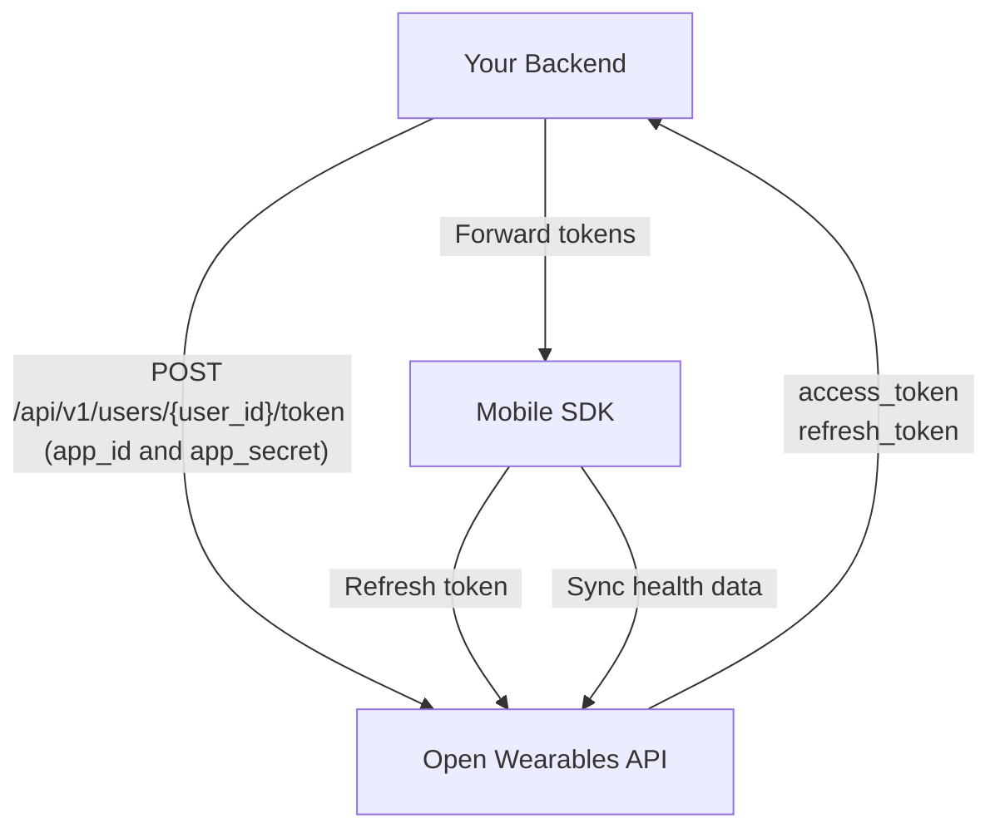

## Overview

This guide walks you through the complete integration of the Open Wearables React Native SDK, from backend setup to production deployment.

<Steps>
  <Step title="Set up backend authentication endpoint" />
  <Step title="Configure the SDK in your React Native app" />
  <Step title="Implement sign-in flow" />
  <Step title="Request health permissions" />
  <Step title="Start background sync" />
</Steps>

## Authentication Architecture

The SDK supports two authentication modes: **token-based** (recommended) and **API key**. The token-based flow keeps your API keys safe on your backend:

<Steps>
  <Step title="Your Backend generates token" icon="server">
      Your backend calls the Open Wearables API with your **App credentials** (`app_id` + `app_secret`) to generate a user-scoped token (server-to-server, HTTPS) via [Create User Token](/api-reference/mobile-sdk/create-user-token) endpoint. Open Wearables returns `access_token` + `refresh_token`.
  </Step>
  <Step title="Your Backend returns tokens to the app" icon="key">
    Your backend exposes its own custom endpoint that forwards the `access_token` and `refresh_token` to the mobile app. **Never expose `app_id` or `app_secret` to the client.**
  </Step>
  <Step title="Mobile App calls SDK signIn" icon="mobile">
    The React Native app receives the tokens and passes them to `OpenWearablesHealthSdk.signIn(accessToken, refreshToken)`.
  </Step>
  <Step title="SDK stores & syncs" icon="lock">
    React Native SDK stores credentials in iOS Keychain / Android EncryptedSharedPreferences and uses `accessToken` to sync health data directly to Open Wearables.
  </Step>
</Steps>



<Warning>
  **Never embed your `app_id` / `app_secret` in the mobile app.** App credentials should only exist on your backend server. Only the `access_token` and `refresh_token` are passed to the mobile app.
</Warning>

## Step 1: Backend Setup

Your backend needs a single endpoint that generates access tokens for your users by calling the Open Wearables API and forwarding the tokens.

### Generate Access Token

When a user wants to connect their health data, your backend should:

1. Authenticate the user (your own auth system)
2. Call Open Wearables API at [`POST /api/v1/users/{user_id}/token`](/api-reference/mobile-sdk/create-user-token) with your App credentials
3. Return the token to the mobile app

<Tabs>
  <Tab title="Node.js">
```javascript
// Express.js example
const express = require('express');
const app = express();

app.post('/api/health/connect', authenticateUser, async (req, res) => {
  try {
    // 1. Get your authenticated user and their stored OW user ID
    const owUserId = req.user.owUserId; // Stored when user was first registered

    // 2. Call Open Wearables API to generate token
    const response = await fetch(`${process.env.OPENWEARABLES_HOST}/api/v1/users/${owUserId}/token`, {
      method: 'POST',
      headers: {
        'Content-Type': 'application/json',
      },
      body: JSON.stringify({
        app_id: process.env.OPENWEARABLES_APP_ID,       // Secret! Never expose!
        app_secret: process.env.OPENWEARABLES_APP_SECRET, // Secret! Never expose!
      }),
    });

    if (!response.ok) {
      throw new Error('Failed to generate token');
    }

    const { access_token, refresh_token } = await response.json();

    // 3. Return credentials to mobile app (NOT the app credentials!)
    res.json({
      userId: owUserId,
      accessToken,
      refreshToken,
    });
  } catch (error) {
    console.error('Health connect error:', error);
    res.status(500).json({ error: 'Failed to connect health' });
  }
});
```
  </Tab>

  <Tab title="Python">
```python
# FastAPI example
from fastapi import FastAPI, Depends, HTTPException
import httpx
import os

app = FastAPI()

@app.post("/api/health/connect")
async def connect_health(current_user = Depends(get_current_user)):
    # 1. Get the stored OW user ID for this user
    ow_user_id = current_user.ow_user_id  # Stored when user was first registered

    # 2. Call Open Wearables API to generate token
    async with httpx.AsyncClient() as client:
        response = await client.post(
            f"{os.environ['OPENWEARABLES_HOST']}/api/v1/users/{ow_user_id}/token",
            json={
                "app_id": os.environ["OPENWEARABLES_APP_ID"],
                "app_secret": os.environ["OPENWEARABLES_APP_SECRET"],
            },
        )

        if response.status_code != 200:
            raise HTTPException(500, "Failed to generate token")

        data = response.json()

    # 3. Return credentials to mobile app
    return {
        "userId": str(ow_user_id),
        "accessToken": data["access_token"],
        "refreshToken": data.get("refresh_token"),
    }
```
  </Tab>

  <Tab title="Ruby">
```ruby
# Rails controller example
class HealthController < ApplicationController
  before_action :authenticate_user!

  def connect
    # 1. Get the stored OW user ID for this user
    ow_user_id = current_user.ow_user_id  # Stored when user was first registered

    # 2. Call Open Wearables API to generate token
    response = HTTParty.post(
      "#{ENV['OPENWEARABLES_HOST']}/api/v1/users/#{ow_user_id}/token",
      headers: { 'Content-Type' => 'application/json' },
      body: {
        app_id: ENV['OPENWEARABLES_APP_ID'],
        app_secret: ENV['OPENWEARABLES_APP_SECRET']
      }.to_json
    )

    if response.success?
      # 3. Return credentials to mobile app
      render json: {
        userId: ow_user_id,
        accessToken: response['access_token'],
        refreshToken: response['refresh_token']
      }
    else
      render json: { error: 'Failed to connect' }, status: 500
    end
  end
end
```
  </Tab>
</Tabs>

<Note>
  The `user_id` in the URL is the Open Wearables User ID (UUID). You should store this mapping in your database when you first [Create User](/api-reference/users/create-user) via the Open Wearables API.
</Note>

## Step 2: SDK Configuration

Configure the SDK once at app startup, typically in your main initialization code.

```TypeScript
import OpenWearablesHealthSDK from "open-wearables";

export default function App() {
  useEffect(() => {
    OpenWearablesHealthSDK.configure("https://your-api-host.com");
    ...
  }, []);
}
```

### Configuration Options

| Parameter | Type | Description |
|-----------|------|-------------|
| `host` | `String` | **Required.** The Open Wearables API URL (e.g. `https://api.openwearables.io`) |

```TypeScript
// For self-hosted Open Wearables
OpenWearablesHealthSDK.configure("https://your-domain.com");
```

### Session Restoration

On app startup, call `getStoredCredentials()` to retrieve any previously saved session. If a host is stored, pass it to `configure()`, then check `isSessionValid()` to decide whether a fresh sign-in is needed:

```TypeScript
import OpenWearablesHealthSDK from "open-wearables";

useEffect(() => {
  const init = async () => {
    const stored = OpenWearablesHealthSDK.getStoredCredentials();

    if (stored?.host) {
      OpenWearablesHealthSDK.configure(stored.host);
    }

    if (OpenWearablesHealthSDK.isSessionValid()) {
      // Session restored — sync can start immediately
    } else {
      // No valid session — prompt user to sign in
    }
  };

  init();
}, []);
```

## Step 3: Sign In

After getting credentials from your backend, sign in with the SDK:

<Info>
  The `userId` parameter is the **Open Wearables User ID** (UUID) — the `id` returned by the [Create User](/api-reference/users/create-user) endpoint. Do **not** pass your own `external_user_id` here.
</Info>

### Token-Based Authentication (Recommended)

```TypeScript
import OpenWearablesHealthSDK from "open-wearables";

// 1. Get credentials from YOUR backend
const response = await fetch('https://your-api-host.com/api/health/connect', { method: 'POST' });
const credentials = await response.json();

// 2. Sign in with the SDK
await OpenWearablesHealthSDK.signIn(
  credentials.userId,
  credentials.accessToken,
  credentials.refreshToken,
  null
);
```

### API Key Authentication

For simpler setups (e.g. internal tools), you can use API key authentication directly:

```TypeScript
import OpenWearablesHealthSDK from "open-wearables";

// Sign in with API Key
await OpenWearablesHealthSDK.signIn(
  'your_user_id',
  null,
  null,
  'your_api_key'
);
```

<Warning>
  API key authentication embeds the key in the app. Only use this for internal or trusted applications. For production apps, always use token-based authentication.
</Warning>

### Automatic Token Refresh

When you provide a `refreshToken`, the SDK automatically handles 401 responses by refreshing the access token and retrying the request.

You can also update tokens manually:

```TypeScript
import OpenWearablesHealthSDK from "open-wearables";

OpenWearablesHealthSDK.updateTokens(accessToken, refreshToken);
```

## Step 4: Request Permissions

Request access to specific health data types:

```TypeScript

import OpenWearablesHealthSDK from "open-wearables";

let permission = await OpenWearablesHealthSDK.requestAuthorization([  
    HealthDataType.Steps,
    HealthDataType.HeartRate,
    HealthDataType.Sleep
]);
```

<Note>
  On iOS, users can grant partial permissions. The SDK will sync whatever data the user allows.
</Note>

<Tip>
  Request only the data types you actually need. Requesting too many types can overwhelm users and reduce acceptance rates.
</Tip>

### Android Provider Selection

On Android, you must select a health data provider before requesting authorization. Call `getAvailableProviders()` to list what is installed on the device, then call `setProvider(id)` with the chosen provider's `id`.

```TypeScript
import AsyncStorage from "@react-native-async-storage/async-storage";
// Expo projects: import * as SecureStore from "expo-secure-store";
import { Platform } from "react-native";
import OpenWearablesHealthSDK from "open-wearables";

const PROVIDER_KEY = "health_provider";

async function selectAndSaveProvider(): Promise<boolean> {
  if (Platform.OS !== "android") return true;

  const providers = OpenWearablesHealthSDK.getAvailableProviders();
  if (providers.length === 0) return false;

  // Restore the previously chosen provider if it is still available
  const savedId = await AsyncStorage.getItem(PROVIDER_KEY);
  const restored = savedId
    ? providers.find((p) => p.id === savedId && p.isAvailable)
    : null;

  const chosen =
    restored ??
    providers.find((p) => p.id === "google" && p.isAvailable) ??
    providers.find((p) => p.isAvailable);

  if (!chosen) return false;

  await AsyncStorage.setItem(PROVIDER_KEY, chosen.id);
  return OpenWearablesHealthSDK.setProvider(chosen.id);
}
```

<Tip>
  Persist the selected provider ID so the user's choice survives app restarts. Use [`@react-native-async-storage/async-storage`](https://github.com/react-native-async-storage/async-storage) for bare React Native projects, or [`AsyncStorage` from `expo-secure-store`](https://docs.expo.dev/versions/latest/sdk/securestore/) for Expo apps (though a plain key like a provider ID doesn't require encryption — `AsyncStorage` is sufficient).
</Tip>

<Note>
  `getAvailableProviders()` returns an empty array on iOS — provider selection is not needed there, as HealthKit is the only source.
</Note>

## Step 5: Start Background Sync

Enable background sync to keep data flowing even when your app is in the background:

```TypeScript
import OpenWearablesHealthSDK from "open-wearables";


// Start background sync
await OpenWearablesHealthSDK.startBackgroundSync();

// Check sync status
console.log(`Sync active: ${OpenWearablesHealthSDK.isSyncActive()}`);
```

### Background Sync Behavior

<Tabs>
  <Tab title="iOS">
    | Mechanism | Frequency |
    |-----------|-----------|
    | HealthKit Observer Queries | Immediate on new data |
    | BGAppRefreshTask | Every ~15 minutes (system-managed) |
    | BGProcessingTask | Network-required background processing |
  </Tab>
  <Tab title="Android">
    | Mechanism | Frequency |
    |-----------|-----------|
    | WorkManager | Periodic sync with foreground service |
    | Foreground Service | Used during active sync for reliability |
  </Tab>
</Tabs>

<Warning>
  Background sync frequency is managed by the OS and may vary based on battery level, network conditions, and user behavior.
</Warning>

### Manual Sync

Trigger an immediate sync when needed:

```TypeScript
import OpenWearablesHealthSDK from "open-wearables";

await OpenWearablesHealthSDK.syncNow();
```

### Log Level

Control SDK log output using `setLogLevel`. By default, the SDK uses `OWLogLevel.debug`, which prints logs only in debug builds:

```TypeScript
import OpenWearablesHealthSDK, { OWLogLevel } from "open-wearables";

// Always show logs (including release builds)
OpenWearablesHealthSDK.setLogLevel(OWLogLevel.always);

// Only show logs in debug builds (default)
OpenWearablesHealthSDK.setLogLevel(OWLogLevel.debug);

// Disable all logs
OpenWearablesHealthSDK.setLogLevel(OWLogLevel.none);

// Read the current level
const current = OpenWearablesHealthSDK.getLogLevel();
```

| Level | Description |
|-------|-------------|
| `OWLogLevel.none` | No logs at all |
| `OWLogLevel.always` | Logs are always printed regardless of build mode |
| `OWLogLevel.debug` | Logs are printed only in debug builds (default) |

<Tip>
  Set `OWLogLevel.always` during development or when troubleshooting sync issues in production. Switch to `OWLogLevel.none` if you want to suppress all SDK output.
</Tip>

## Complete Integration Example

Here's a complete service class showing the full integration:

```TypeScript
import AsyncStorage from "@react-native-async-storage/async-storage";
import { Platform } from "react-native";
import OpenWearablesHealthSDK, {
  HealthDataType,
  OWLogLevel,
} from "open-wearables";

const PROVIDER_KEY = "health_provider";

class HealthSyncService {
  private readonly owHost: string;
  private readonly backendUrl: string;
  private readonly authToken: string;

  private subscriptions: { remove: () => void }[] = [];

  constructor({
    owHost,
    backendUrl,
    authToken,
  }: {
    owHost: string;
    backendUrl: string;
    authToken: string;
  }) {
    this.owHost = owHost;
    this.backendUrl = backendUrl;
    this.authToken = authToken;
  }

  /** Initialize the SDK and restore any existing session */
  async initialize(): Promise<void> {
    this._cleanupListeners()

    // Set up event listeners
    const logSub = OpenWearablesHealthSDK.addListener("onLog", ({ message }) => {
      console.log(`[HealthSync] ${message}`);
    });
    const authSub = OpenWearablesHealthSDK.addListener("onAuthError", ({ statusCode, message }) => {
      console.error(`[HealthSync] Auth error ${statusCode}: ${message}`);
    });

    this.subscriptions.push(logSub, authSub);

    // Enable logs in all builds for debugging (default is debug-only)
    OpenWearablesHealthSDK.setLogLevel(OWLogLevel.always);

    // Restore previously saved session
    const stored = OpenWearablesHealthSDK.getStoredCredentials();
    const host = stored?.host ?? this.owHost;
    OpenWearablesHealthSDK.configure(host);
  }

  private _cleanupListeners(): void {
    this.subscriptions.forEach((sub) => {
      try {
        sub.remove();
      } catch {}
    });
    this.subscriptions = [];
  }

  get isConnected(): boolean {
    return OpenWearablesHealthSDK.isSessionValid();
  }

  get isSyncing(): boolean {
    return OpenWearablesHealthSDK.isSyncActive();
  }

  /** Connect health data for the current user */
  async connect(): Promise<void> {
    if (OpenWearablesHealthSDK.isSessionValid()) {
      if (!OpenWearablesHealthSDK.isSyncActive()) {
        await this._startSync();
      }
      return;
    }

    await this._signIn();
    await this._startSync();
  }

  private async _signIn(): Promise<void> {
    // Call YOUR backend — not the Open Wearables API directly
    const response = await fetch(`${this.backendUrl}/api/health/connect`, {
      method: "POST",
      headers: {
        Authorization: `Bearer ${this.authToken}`,
        "Content-Type": "application/json",
      },
    });

    if (!response.ok) {
      throw new Error("Failed to get health credentials");
    }

    const data = await response.json();

    await OpenWearablesHealthSDK.signIn(
      data.userId,
      data.accessToken,
      data.refreshToken,
      null
    );
  }

  private async _startSync(): Promise<void> {
    if (Platform.OS === "android") {
      const providers = OpenWearablesHealthSDK.getAvailableProviders();
      const savedId = await AsyncStorage.getItem(PROVIDER_KEY);

      // Restore saved provider or pick the best available one
      const restored = savedId
        ? providers.find((p) => p.id === savedId && p.isAvailable)
        : null;
      const chosen =
        restored ??
        providers.find((p) => p.id === "google" && p.isAvailable) ??
        providers.find((p) => p.isAvailable);

      if (!chosen) {
        throw new Error(
          "No supported health provider available on this device. " +
          "Please install Health Connect or Samsung Health."
        );
      }

      await AsyncStorage.setItem(PROVIDER_KEY, chosen.id);
      OpenWearablesHealthSDK.setProvider(chosen.id);
    }

    const authorized = await OpenWearablesHealthSDK.requestAuthorization(
      Object.values(HealthDataType)
    );

    if (!authorized) {
      throw new Error("Health permissions not granted");
    }

    await OpenWearablesHealthSDK.startBackgroundSync();
  }

  /** Disconnect and stop syncing */
  async disconnect(): Promise<void> {
    await OpenWearablesHealthSDK.stopBackgroundSync();
    await OpenWearablesHealthSDK.signOut();
  }

  destroy(): void {
    this._cleanupListeners();
  }

  /** Force an immediate sync */
  async syncNow(): Promise<void> {
    await OpenWearablesHealthSDK.syncNow();
  }
}
```

### Using the Service

```TypeScript
import { useEffect, useRef, useState } from "react";
import { Button, Text, View } from "react-native";

export default function App() {
  const serviceRef = useRef<HealthSyncService | null>(null);
  const [isConnected, setIsConnected] = useState(false);
  const [isSyncing, setIsSyncing] = useState(false);

  useEffect(() => {
    const service = new HealthSyncService({
      owHost: "https://api.openwearables.io",
      backendUrl: "https://api.yourapp.com",
      authToken: "your_auth_token", // Retrieve from your auth system
    });
    serviceRef.current = service;

    const init = async () => {
      await service.initialize();
      setIsConnected(service.isConnected);
      setIsSyncing(service.isSyncing);
    };

    init().catch(console.error);

    return () => {
      service.destroy();
    };
  }, []);

  const handleConnect = async () => {
    try {
      await serviceRef.current?.connect();
      setIsConnected(true);
      setIsSyncing(Boolean(serviceRef.current?.isSyncing));
    } catch (e) {
      console.error("Failed to connect health:", e);
    }
  };

  const handleDisconnect = async () => {
    await serviceRef.current?.disconnect();
    setIsConnected(false);
    setIsSyncing(false);
  };

  return (
    <View>
      <Text>Status: {isConnected ? "Connected" : "Disconnected"}</Text>
      <Text>Sync: {isSyncing ? "Active" : "Inactive"}</Text>
      <Button
        title={isConnected ? "Disconnect" : "Connect Health"}
        onPress={isConnected ? handleDisconnect : handleConnect}
      />
    </View>
  );
}
```

## Data Sync Endpoint

The SDK sends health data to:

<ParamField path="host" type="string" required>
  Your Open Wearables API base URL (e.g. `https://api.example.com`).
</ParamField>

<ParamField path="userId" type="string" required>
  The user ID returned when registering the SDK user.
</ParamField>

```bash
POST {host}/api/v1/sdk/users/{userId}/sync
```

Data is automatically normalized to the Open Wearables unified data model and can be accessed through the standard API endpoints.

## Next Steps

<CardGroup cols={2}>
  <Card title="Troubleshooting" icon="wrench" href="/sdk/react-native/troubleshooting">
    Common issues and solutions for iOS and Android.
  </Card>
  <Card title="Data Types" icon="database" href="/architecture/data-types">
    Available health metrics and data formats.
  </Card>
</CardGroup>
